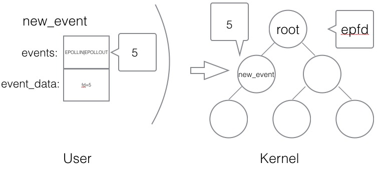
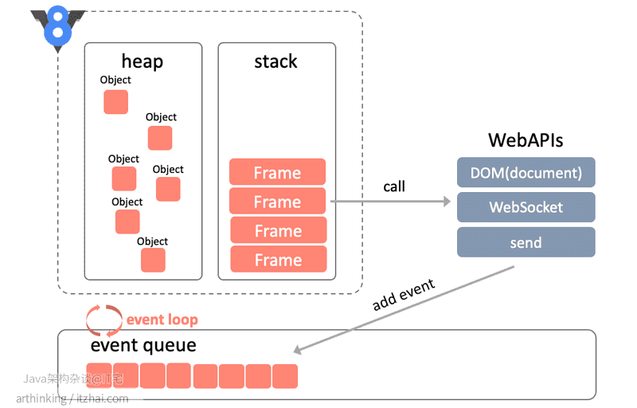
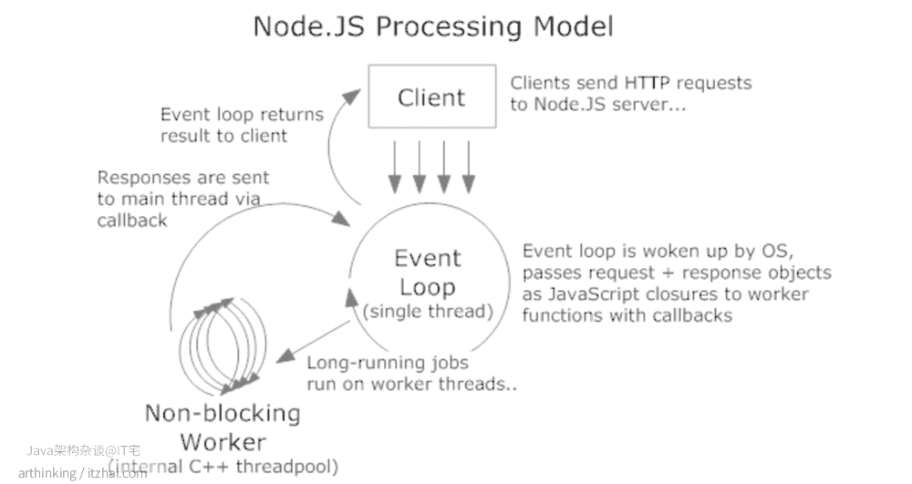

# 分析eventLoop

## 1. 阻塞


- 概述

IO指的就是硬盘文件(open/read/write)的读写、网卡(socket/read/write)等外部设备的读写、键盘、鼠标输入/屏幕输出.....

通常可以分为两类: 块设备(block device)和字符设备(character device)。 块设备将信息存储在固定大小的块中， 每个块有自己的地址， 例如硬盘， U盘。 字符设备以字符为单位发送或者接收一个字符流， 不考虑任何块结构。 字符设备是不可寻址的， 也没有任何的寻道操作， 例如网卡

直接存取: CPU发出指令,将磁盘中的某个数据读入内存，磁盘的设备控制器接受到指令后，对磁盘进行磁臂调度,并读取数据到设备缓冲区,校验通过后传至内存中

由于CPU、内存和磁盘之间的处理速度有着巨大的差异，从发出指令开始，到数据写入内存，对于CPU而言，可能过了几年之久。。。

当CPU要读取文件时， 对DMA控制器中的寄存器进行编程， 将要读的文件地址， 字节数等数据传入DMA控制器寄存器中。 此时CPU进行进程或者是线程切换， 调度其它任务的执行。

DMA控制器接收指令后向磁盘设备控制器请求数据， 并要求磁盘将数据写入到内存的一块区域内。

磁盘设备控制器调用磁盘驱动程序进行数据读取， 在磁盘缓冲区组装并检验完成后， 通过总线将数据写入内存中。

写入完成后磁盘设备控制器通过总线向DMA发送信号， 告之以完成相关操作。

DMA控制器发起硬件中断， 如果CPU此时能够处理中断， 则处理该中断， 并完成文件读操作。

多由系统自身或与链接的外设(键盘、鼠标、网卡等)产生,中断首先是处理器提供的一种响应外设请求的机制，是处理器硬件支持的特性。一个外设通过产生一种电信号通知中断控制器，中断控制器再向处理器发送响应的信号

```
+---------+   产生中断      +----------+   通知    +-----+
| 硬件设备 | -------------&gt; | 中断控制器 | -------&gt; | CPU |
+---------+                +----------+          +-----+
                                                    |
                                                    V
                                                 [中断内核]
                                                    |
                                                    V
                       [是否存在中断处理程序？] &lt;--- do_IRQ()
                                 |
                         +-------+-------+
                         |Y             N|
                         V               |
                  handle_IRQ_event       |
                         |               |
                         V               |
                   执行中断处理程序         |
                         |               V
                         +----------&gt; irq_exit ----&gt; 恢复现场 .....
```

- 大致的流程

1. CPU会把就绪状态的进程通过调度(分派CPU时间片),进程转为运行状态

2. 处于运行状态的进程在时间片用完之后，不得不让出CPU,从而转化为就绪态,剥夺了它对CPU的使用权进程与进程之间切换会产生CPU上下文切换,还额外要保存每个进程的虚拟内存

3. 当进程中有IO操作的时候,应用程序会发送软中断,INT0x80,该指令会让CPU跳转到一个预设的内核空间地址上去,进程由用户态陷入到内核态,它指向系统调用的处理函数system_call 系统调用会产生CPU上下文切换,不同的是在同一个进程中,只需要保存CPU寄存器

4. system_call根据具体的系统调用号转到执行具体的系统调用服务例程,例如sys_read(),CPU继续执行内核态中的系统调用函数

5. 当网卡没有数据到来的时候,当前内核会阻塞等待网卡的数据过来...（进程也处于阻塞的状态）,CPU因为有DMA,所以不必等待网卡的数据,可以调度其他的进程... 当前进程变为阻塞状态后便不会被调度...

6. 网卡接收到数据包的时候,会产生硬件中断,因为要快速传送数据,硬件中断会交给DMA,DMA会通知CPU恢复当前进程的调度,将当前进程由阻塞态转化为运行态(处于内核中),内核调用中断处理程序响应--内核将数据不断的读入自己的缓冲区对网卡、磁盘文件的读写会以硬中断的形式进行,快速处理

7. 内核进行协议栈的解析/数据的解封等操作，再将内核缓冲区中的数据拷贝到用户进程的缓冲区，并返回系统调用，回到用户态

代码中的任何读写文件、读写socket操作默认都是阻塞的,一旦速度较慢的话,CPU会去执行其他的进程,等IO操作结束后,再通知CPU继续执行剩余的代码...这里，CPU会在这些运行态的进程之间来回的切换....以提高CPU的利用率


```
    //接受一个客户端的连接,如果没有连接过来,阻塞在这里(三次握手阶段)
    cfd = accept(lfd,(struct sockaddr *)&clie_addr,&clie_addr_len);
    while(1){
        //   通知进程可读 <----- 内核缓冲区(协议栈解析) <--------- 网卡（解帧格式）<---- 交换机/路由器<------ 客户端数据(数据传输-请求阶段)
        //如果客户端数据迟迟没有来,也会阻塞在这里.... 
        n = read(cfd,buf,sizeof(buf));
        //程序对数据进行处理....
        for(i=0;i<n;i++){
            buf[i] = toupper(buf[i]); 
        }
        //write通知内核写入 ----> 内核缓冲区（协议栈解析） -----> 网卡（封装帧格式） -----> 交换机/路由器 ---> 客户端(数据传输-响应阶段)
        //如果客户端迟迟不读数据,内核缓冲区数据满了之后,也会阻塞在这里....
        write(cfd,buf,n);
    }
```

## 2. epoll

- select 

```js
while true {
    select(流[]);  //阻塞

    for i in 流[] {
        if i has 数据 {
            读 或者 其他处理
        }
    }
}
```
> select 代收员 比较懒，她只会告诉你快递到了，但是是谁到的，你需要挨个快递员问一遍。

- epoll 

```js
while true {
    可处理的流[] = epoll_wait(epoll_fd);  //阻塞
    for i in 可处理的流[] {
        读 或者 其他处理
   }
}
```
> 只关心“活跃”的链接，无需遍历全部描述符集合

- 创建epoll 

```c
/**
 * @param size 告诉内核监听的数目
 *
 * @returns 返回一个epoll句柄（即一个文件描述符）
 */
int epoll_create(int size);

int epfd = epoll_create(1000);
```

- 控制epoll

```c
/**
 * @param epfd 用epoll_create所创建的epoll句柄
 * @param op 表示对epoll监控描述符控制的动作
 *
 * EPOLL_CTL_ADD(注册新的fd到epfd)
 * EPOLL_CTL_MOD(修改已经注册的fd的监听事件)
 * EPOLL_CTL_DEL(epfd删除一个fd)
 *
 * @param fd 需要监听的文件描述符
 * @param event 告诉内核需要监听的事件
 *
 * @returns 成功返回0，失败返回-1, errno查看错误信息
 */
int epoll_ctl(int epfd, int op, int fd, 
            struct epoll_event *event);


struct epoll_event {
 __uint32_t events; /* epoll 事件 */
 epoll_data_t data; /* 用户传递的数据 */
}

/*
 * events : {EPOLLIN, EPOLLOUT, EPOLLPRI, 
            EPOLLHUP, EPOLLET, EPOLLONESHOT}
 */

typedef union epoll_data {
    void *ptr;
    int fd;
    uint32_t u32;
    uint64_t u64;
} epoll_data_t;


struct epoll_event new_event;

new_event.events = EPOLLIN | EPOLLOUT;
new_event.data.fd = 5;
// 
epoll_ctl(epfd, EPOLL_CTL_ADD, 5, &new_event);
```


- 等待EPOLL

```js
/**
 *
 * @param epfd 用epoll_create所创建的epoll句柄
 * @param event 从内核得到的事件集合,***结果返回***
 * @param maxevents 告知内核这个events有多大,
 *             注意: 值 不能大于创建epoll_create()时的size.
 * @param timeout 超时时间
 *     -1: 永久阻塞
 *     0: 立即返回，非阻塞
 *     >0: 指定微秒
 *
 * @returns 成功: 有多少文件描述符就绪,时间到时返回0
 *          失败: -1, errno 查看错误
 */
int epoll_wait(int epfd, struct epoll_event *event, 
            int maxevents, int timeout);

struct epoll_event my_event[1000];

int event_cnt = epoll_wait(epfd, my_event, 1000, -1);
```


- 编程实例

```c
//创建 epoll
int epfd = epoll_crete(1000);

//将 listen_fd 添加进 epoll 中
epoll_ctl(epfd, EPOLL_CTL_ADD, listen_fd,&listen_event);

while (1) {
    //阻塞等待 epoll 中 的fd 触发
    int active_cnt = epoll_wait(epfd, events, 1000, -1);

    for (i = 0 ; i < active_cnt; i++) {
        if (evnets[i].data.fd == listen_fd) {
            //accept. 并且将新accept 的fd 加进epoll中.
        }
        else if (events[i].events & EPOLLIN) {
            //对此fd 进行读操作
        }
        else if (events[i].events & EPOLLOUT) {
            //对此fd 进行写操作
        }
    }
}
```

## 3. 触发模式

- 水平触发


水平触发的主要特点是，如果用户在监听epoll事件，当内核有事件的时候，会拷贝给用户态事件，但是如果用户只处理了一次，那么剩下没有处理的会在下一次epoll_wait再次返回该事件。

这样如果用户永远不处理这个事件，就导致每次都会有该事件从内核到用户的拷贝，耗费性能，但是水平触发相对安全，最起码事件不会丢掉，除非用户处理完毕。

- 边缘触发


边缘触发，相对跟水平触发相反，当内核有事件到达， 只会通知用户一次，至于用户处理还是不处理，以后将不会再通知。这样减少了拷贝过程，增加了性能，但是相对来说，如果用户马虎忘记处理，将会产生事件丢的情况。

这就意味着，在边缘触发的模式下，只会在文件描述符的可读/可写状态发生变化的时候才会接到通知。因此，如果使用epoll的边缘触发，在收到通知的时候，必须使用非阻塞的IO，循环调用read/write多次，将数据全部度写完。

如果设置了阻塞，并且在这次读事件触发的时候，没有一次性读写完所有的数据，那么在操作系统看来，这个文件描述符没有发生变化(读 --> 读),将不会再发起通知,调用epoll_wait 会使得文件描述符一致等待，服务器也会等待客户端的响应

除了epoll_wait之外，其余的read/write都应该是非阻塞的才行

## 4. epoll服务器开发实例 -- 阻塞模式（默认）

```c
#include <stdio.h>
#include <stdlib.h>
#include <ctype.h>
#include <string.h>

#include <unistd.h>
#include <sys/types.h>
#include <sys/socket.h>
#include <arpa/inet.h>

#include <sys/epoll.h>


#define SERVER_PORT         (7778)
#define EPOLL_MAX_NUM       (2048)
#define BUFFER_MAX_LEN      (4096)

char buffer[BUFFER_MAX_LEN];

void str_toupper(char *str)
{
    int i;
    for (i = 0; i < strlen(str); i ++) {
        str[i] = toupper(str[i]);
    }
}

int main(int argc, char **argv)
{
    int listen_fd = 0;
    int client_fd = 0;
    struct sockaddr_in server_addr;
    struct sockaddr_in client_addr;
    socklen_t           client_len;

    int epfd = 0;
    struct epoll_event event, *my_events;

    // 创建我的socket:listenFd
    listen_fd = socket(AF_INET, SOCK_STREAM, 0);

    // bind
    server_addr.sin_family = AF_INET;
    server_addr.sin_addr.s_addr = htonl(INADDR_ANY);
    server_addr.sin_port = htons(SERVER_PORT);
    bind(listen_fd, (struct sockaddr*)&server_addr, sizeof(server_addr));

    // listen
    listen(listen_fd, 10);

    // epoll create
    epfd = epoll_create(EPOLL_MAX_NUM);
    if (epfd < 0) {
        perror("epoll create");
        goto END;
    }

    // listen_fd -> 添加到epoll 
    event.events = EPOLLIN;
    event.data.fd = listen_fd;
    if (epoll_ctl(epfd, EPOLL_CTL_ADD, listen_fd, &event) < 0) {
        perror("epoll ctl add listen_fd ");
        goto END;
    }
    // 创建一个myEvent的大数组，接收返回结果的大数组
    my_events = (epoll_event *)malloc(sizeof(struct epoll_event) * EPOLL_MAX_NUM);
    

    while (1) {
        // epoll wait ----> my_events
        int active_fds_cnt = epoll_wait(epfd, my_events, EPOLL_MAX_NUM, -1);
        int i = 0;
        for (i = 0; i < active_fds_cnt; i++) {
            // if fd == listen_fd
            if (my_events[i].data.fd == listen_fd) {
                //accept
                client_fd = accept(listen_fd, (struct sockaddr*)&client_addr, &client_len);
                if (client_fd < 0) {
                    perror("accept");
                    continue;
                }

                char ip[20];
                printf("new connection[%s:%d]\n", inet_ntop(AF_INET, &client_addr.sin_addr, ip, sizeof(ip)), ntohs(client_addr.sin_port));

                event.events = EPOLLIN | EPOLLET;
                event.data.fd = client_fd;
                // 添加到红黑树的节点上
                epoll_ctl(epfd, EPOLL_CTL_ADD, client_fd, &event);
            }
            else if (my_events[i].events & EPOLLIN) {
                printf("EPOLLIN\n");
                client_fd = my_events[i].data.fd;

                // do read

                buffer[0] = '\0';
                int n = read(client_fd, buffer, 5);
                if (n < 0) {
                    perror("read");
                    continue;
                }
                else if (n == 0) {
                    epoll_ctl(epfd, EPOLL_CTL_DEL, client_fd, &event);
                    close(client_fd);
                }
                else {
                    printf("[read]: %s\n", buffer);
                    buffer[n] = '\0';
#if 1
                    str_toupper(buffer);
                    // 服务器将返回结果写回去
                    write(client_fd, buffer, strlen(buffer));
                    printf("[write]: %s\n", buffer);
                    memset(buffer, 0, BUFFER_MAX_LEN);
#endif

/*
                    event.events = EPOLLOUT;
                    event.data.fd = client_fd;
                    epoll_ctl(epfd, EPOLL_CTL_MOD, client_fd, &event);
*/
                }
            }
            else if (my_events[i].events & EPOLLOUT) {
                printf("EPOLLOUT\n");
/*
                client_fd = my_events[i].data.fd;
                str_toupper(buffer);
                write(client_fd, buffer, strlen(buffer));
                printf("[write]: %s\n", buffer);
                memset(buffer, 0, BUFFER_MAX_LEN);

                event.events = EPOLLIN;
                event.data.fd = client_fd;
                epoll_ctl(epfd, EPOLL_CTL_MOD, client_fd, &event);
*/
            }
        }
    }

END:
    close(epfd);
    close(listen_fd);
    return 0;
}
```


## 5. epoll 反应堆模型

- 传统的epoll服务器

监听可读事件(ET) ⇒ 数据到来 ⇒ 触发读事件 ⇒
epoll_wait()返回 ⇒ read消息 ⇒ write回射信息（读完就直接写回了） ⇒ 继续epoll_wait()
⇒ 直到程序停止前都是这么循环

- epoll反应堆服务器模型

监听可读事件(ET) ⇒ 数据到来 ⇒ 触发事件 ⇒ epoll_wait()返回 ⇒
读取完数据(可读事件回调函数内) ⇒ 将该节点从红黑树上摘下(可读事件回调函数内) ⇒ 设置可写事件和对应可写回调函数(可读事件回调函数内) ⇒ 挂上树(可读事件回调函数内) ⇒ 处理数据(可读事件回调函数内)


⇒ 监听可写事件(ET) ⇒ 对方可读 ⇒ 触发事件 ⇒ epoll_wait()返回 ⇒
写完数据(可写事件回调函数内) ⇒ 将该节点从红黑树上摘下(可写事件回调函数内) ⇒ 设置可读事件和对应可读回调函数(可写读事件回调函数内) ⇒ 挂上树(可写事件回调函数内) ⇒ 处理收尾工作(可写事件回调函数内) ⇒ 直到程序停止前一直这么交替循环 

至此，结束

## 6. epoll的反应堆模型实现

```c
#include <stdlib.h>
#include <stdio.h>
#include <sys/socket.h>
#include <arpa/inet.h>
#include <fcntl.h>
#include <unistd.h>
#include <errno.h>
#include <string.h>
#include <time.h>
#define MAX_EVENTS 1024
#define BUFLEN 128
#define SERV_PORT 8080
// 事件的结构体
struct myevent_s {
    int fd;  // cfd,listenfd
    int events;
    void *arg; // 指向自己结构体的指针
    void (*call_back)(int fd,int events, void *arg);
    int status;
    char buf[BUFLEN];
    int len;
    long last_active;
}
int g_efd;
// 事件数组
struct myevent_s g_events[MAX_EVENTS + 1] /* +1 最后一个用于 listen fd */
// 设置事件的函数
void eventset(struct myevnet_s *ev,int fd, void(*call_back)(int, int, void *),void *arg){
    ev->fd = fd;
    ev->call_back = call_back;
    ev->events = 0;
    ev->arg = arg;
    ev->status = 0;
    ev->last_active = time(NULL);
    return;
}
void recvdata(int fd, int events, void *arg);
void senddata(int fd, int events, void *arg);

void eventadd(int efd,int events,struct myevent_s *ev){
    // 创建一个epoll 节点 , epoll_event对象作为最后一个参数
    struct epoll_event epv = {0,{0}};
    int op;
    epv.data.ptr = ev; // 指针指向我们的事件的数组
    epv.events = ev->events = events; // events : EPOLLIN, EPOLLOUT, EPOLLPRI
    if(ev->status == 1){
        op = EPOLL_CTL_MOD
    }else{
        op = EPOLL_CTL_ADD
        ev->status = 1;
    }
    if (epoll_ctl(efd, op, ev->fd, &epv) < 0)
        printf("event add failed [fd=%d], events[%d]\n", ev->fd, events);
    else
        printf("event add OK [fd=%d], op=%d, events[%0X]\n", ev->fd, op, events);

    return;
}
void eventdel(int efd, struct myevent_s *ev)
{
    // 删除我们的epoll节点
    struct epoll_event epv = {0, {0}};

    if (ev->status != 1)
        return;

    epv.data.ptr = ev;
    ev->status = 0;
    epoll_ctl(efd, EPOLL_CTL_DEL, ev->fd, &epv);
    return;
}
void acceptconn(int lfd,int events,void *arg){
    struct sockaddr_in cin;
    socklen_t len = sizeof(cin);
    inf cfd,i;
    if((cfd = accept(lfd, (struct sockaddr *)&cin, &len)) == -1) {
        if (errno != EAGAIN && errno != EINTR) {
            /* 暂时不做出错处理 */
        }
        printf("%s: accept, %s\n", __func__, strerror(errno));
        return;
    }
    do {
        for(i = 0;i<MAX_EVNETS;i++){
            // 循环我的事件数组
            if(g_events[i].status == 0) break;
            if(i == MAX_EVENTS){
                printf("%s: max connect limit[%d]\n", __func__, MAX_EVENTS);
            break;
            }
            int flag = 0;
            if ((flag = fcntl(cfd, F_SETFL, O_NONBLOCK)) < 0)
        {
            // 将accept客户端请求clientfd设置为非阻塞模式,配合epoll边缘触发
            printf("%s: fcntl nonblocking failed, %s\n", __func__, strerror(errno));
            break;
        }
        // 设置我们的事件对象
        eventset(&g_events[i], cfd, recvdata, &g_events[i]);
        // accept的时候,将当前客户端的请求节点加入到事件数组中
        eventadd(g_efd, EPOLLIN, &g_events[i]);
        }
    }while(0)
    printf("new connect [%s:%d][time:%ld], pos[%d]\n", inet_ntoa(cin.sin_addr), ntohs(cin.sin_port), g_events[i].last_active, i);

    return;
}
// 接收数据
void recvdata(int fd,int events,void *arg){
    struct myevent_s *ev = (struct myevent_s *)arg;
    int len;

    len = recv(fd, ev->buf, sizeof(ev->buf), 0);
    eventdel(g_efd, ev);

    if (len > 0) {
        ev->len = len;
        ev->buf[len] = '\0';
        printf("C[%d]:%s\n", fd, ev->buf);
        /* 转换为发送事件 */
        eventset(ev, fd, senddata, ev);
        eventadd(g_efd, EPOLLOUT, ev);
    }
    else if (len == 0) {
        close(ev->fd);
        /* ev-g_events 地址相减得到偏移元素位置 */
        printf("[fd=%d] pos[%d], closed\n", fd, (int)(ev - g_events));
    }
    else {
        close(ev->fd);
        printf("recv[fd=%d] error[%d]:%s\n", fd, errno, strerror(errno));
    }

    return;

}
// 发送数据
void senddata(int fd, int events, void *arg){
    struct myevent_s *ev = (struct myevent_s *)arg;
    int len;

    len = send(fd, ev->buf, ev->len, 0);
    //printf("fd=%d\tev->buf=%s\ttev->len=%d\n", fd, ev->buf, ev->len);
    //printf("send len = %d\n", len);

    eventdel(g_efd, ev);
    if (len > 0) {
        printf("send[fd=%d], [%d]%s\n", fd, len, ev->buf);
        eventset(ev, fd, recvdata, ev);
        eventadd(g_efd, EPOLLIN, ev);
    }
    else {
        close(ev->fd);
        printf("send[fd=%d] error %s\n", fd, strerror(errno));
    }

    return;
}
// 初始化
void initlistensocket(int efd, short port){
    int lfd = socket(AF_INET, SOCK_STREAM, 0);
    // 这里，具体为什么高性能的服务器要将服务端的listen设置成非阻塞模式，原因有：
    // 
    fcntl(lfd, F_SETFL, O_NONBLOCK); // 将listenfd设置为非阻塞模式
    eventset(&g_events[MAX_EVENTS], lfd, acceptconn, &g_events[MAX_EVENTS]);
    eventadd(efd, EPOLLIN, &g_events[MAX_EVENTS]);

    struct sockaddr_in sin;

    memset(&sin, 0, sizeof(sin));
    sin.sin_family = AF_INET;
    sin.sin_addr.s_addr = INADDR_ANY;
    sin.sin_port = htons(port);

    bind(lfd, (struct sockaddr *)&sin, sizeof(sin));
    listen(lfd, 20);
    return;
}
int main(int argc, char *argv[]) {
    unsigned short port = SERV_PORT;

    if (argc == 2)
        port = atoi(argv[1]);

    g_efd = epoll_create(MAX_EVENTS+1);

    if (g_efd <= 0)
        printf("create efd in %s err %s\n", __func__, strerror(errno));
    // 初始化listenfd
    initlistensocket(g_efd, port);

    /* 事件循环 */
    struct epoll_event events[MAX_EVENTS+1];

    printf("server running:port[%d]\n", port);
    int checkpos = 0, i;
    while (1) {
        /* 超时验证，每次测试100个链接，不测试listenfd 当客户端60秒内没有和服务器通信，则关闭此客户端链接 */
        long now = time(NULL);
        for (i = 0; i < 100; i++, checkpos++) {
            if (checkpos == MAX_EVENTS)
                checkpos = 0;
            if (g_events[checkpos].status != 1)
                continue;
            long duration = now - g_events[checkpos].last_active;
            if (duration >= 60) {
                close(g_events[checkpos].fd);
                printf("[fd=%d] timeout\n", g_events[checkpos].fd);
                eventdel(g_efd, &g_events[checkpos]);
            }
        }
        /* 等待事件发生 */
        int nfd = epoll_wait(g_efd, events, MAX_EVENTS+1, 1000);
        if (nfd < 0) {
            printf("epoll_wait error, exit\n");
            break;
        }
        for (i = 0; i < nfd; i++) {
            struct myevent_s *ev = (struct myevent_s *)events[i].data.ptr;
            // 发生了可读事件的时候 ,包括accept /read 
            if ((events[i].events & EPOLLIN) && (ev->events & EPOLLIN)) {
                ev->call_back(ev->fd, events[i].events, ev->arg);
            }
            // 发生了可写事件的时候 write
            if ((events[i].events & EPOLLOUT) && (ev->events & EPOLLOUT)) {
                ev->call_back(ev->fd, events[i].events, ev->arg);
            }
        }
    }
    /* 退出前释放所有资源 */
    return 0;
}
```


## 7. 浏览器端的eventLoop 



- 在V8引擎中运行JS代码，运行过程中，产生的对象分配在堆中；
- 每当有一个新的方法调用，都会在栈中产生一个新的栈帧Frame，执行完则从栈中弹出，这和JVM虚拟机的运行类似；
- 栈帧可能会触发一个外部API[5]的调用，进而触发在事件队列中加入各种回调事件；
- 在浏览器，每当一个事件发生并有一个事件监听器绑定在该事件上的时候，一个事件消息就会被添加到消息队列中。例如点击了一个按钮元素，就会把这个按钮元素的点击操作封装成事件添加到消息队列中；
JavaScript的事件循环模型永不阻塞。 处理 I/O 通常通过事件和回调来执行；

只要栈中的代码执行完毕，Event Loop主线程就会去读取事件队列，依次执行那些已完成事件所对应的回调函数。

> 同步代码执行完毕，轮询查看事件队列，依次进行执行


## 8. Node层面的evetLoop



- V8引擎解析JS脚本，调用Node API
- libuv库执行Node API，会先将API请求封装成事件，放入事件队列，Event Loop线程处于空闲状态时，就开始遍历处理事件队列中的事件，对事件进行处理：
- 如果不是阻塞任务，直接处理得到结果，通过回调函数返回给V8；
- 如果是阻塞任务，则从Worker线程池中取出一个线程，交给线程处理，最终线程把处理结果设置到事件的结果属性中，把事件放回事件队列，等待Event Loop线程执行回调返回给V8引擎。

Node.js适合请求和响应内容小，无需大量计算逻辑的场景，这能够充分发挥Node.js运行模式的优势。类似的场景有聊天程序。

从以上分析可知，Node.js通过事件驱动，把阻塞的IO任务丢到线程池中进行异步处理，也就是说，Node.js适合I/O密集型任务。

但是，如果碰到CPU密集型任务的时候，Node.js中的EventLoop线程就会自己处理任务，这样会导致在事件队列中的CPU密集型任务没有处理完，那么后面的任务就不会被执行到了，从而导致后续的请求响应变慢。

如下图，本来socket2和socket3很快就可以处理完的，但是由于socket1的任务一直占用着CPU时间，导致socket2和socket3都不能及时得到处理，从表现上看，就是响应变慢了。


## 9. redis0.1启动代码分析

```c
// 初始化服务器的参数
initServerConfig() 
    // 初始化server结构体
    server.dbnum = REDIS_DEFAULT_DBNUM; // 16
    server.port = REDIS_SERVERPORT; // 6379 
    server.verbosity = REDIS_DEBUG; // 0 
    server.maxidletime = REDIS_MAXIDLETIME; // 60*5 = 3000 应该是3s
    server.saveparams = NULL;
    server.logfile = NULL; /* NULL = log on standard output */
    server.bindaddr = NULL;
    server.glueoutputbuf = 1;
    server.daemonize = 0;
    server.pidfile = "/var/run/redis.pid";
    server.dbfilename = "dump.rdb";
    server.requirepass = NULL;
    server.shareobjects = 0;
    server.maxclients = 0;
    ResetServerSaveParams() // 释放server.saveparams的内存空间
        zfree(server.saveparams);
            void zfree(void *ptr) {
                void *realptr;
                size_t oldsize;

                if (ptr == NULL) return;
                // 算出真正的内存首地址
                realptr = (char*)ptr-sizeof(size_t);
                // 算出数据部分的大小
                oldsize = *((size_t*)realptr);
                // 减去释放的内存大小
                used_memory -= oldsize+sizeof(size_t);
                free(realptr);
            }
    server.saveparams = NULL;
    server.saveparamslen = 0;
    // 给sever.saveParams中添加数组对象 ,例如 server.saveParams[0][seconds] or [changes]
    appendServerSaveParams(60*60,1);  /* save after 1 hour and 1 change */
        static void appendServerSaveParams(time_t seconds, int changes) {
            // 在原来saveparams内存的基础上多分配一个元素的内存[]，如果原来是NULL，则直接分配一个元素对应的内存saveParams[0]
            server.saveparams = zrealloc(server.saveparams,sizeof(struct saveparam)*(server.saveparamslen+1));
                    // 重新分配内存，ptr是旧数据的内存首地址，size是本次需要分片的内存大小
                    // ptr 初始的时候为0x0000,size = 16 ===> struct saveParam结构的大小是16字节
                void *zrealloc(void *ptr, size_t size) {
                    void *realptr;
                    size_t oldsize;
                    void *newptr;
                    // ptr为空即没有旧数据，新申请一块内存即可，不涉及数据迁移
                    if (ptr == NULL) return zmalloc(size);
                        // 分配sizeof(size_t)+size大小的内存，前面sizeof(size_t)个字节记录本次分配的大小，记录分配的总内存大小，返回用于存储数据的内存首地址，即跨过sizeof(size_t)大小个字节
                        void *zmalloc(size_t size) {
                            void *ptr = malloc(size+sizeof(size_t));
                            if (!ptr) return NULL;
                            *((size_t*)ptr) = size;
                            used_memory += size+sizeof(size_t);
                            return (char*)ptr+sizeof(size_t);
                        }
                    // 旧数据占据的内存大小
                    realptr = (char*)ptr-sizeof(size_t);
                    // 得到数据部分的内存大小
                    oldsize = *((size_t*)realptr);
                    // 以旧数据的内存地址为基地址，重新分配size+sizeof(size_t)大小的内存
                    newptr = realloc(realptr,size+sizeof(size_t));
                    if (!newptr) return NULL;
                    // 记录数据部分的内存大小
                    *((size_t*)newptr) = size;
                    // 重新计算已分配内存的总大小，sizeof(size_t)这块内存仍然在使用，不需要计算
                    used_memory -= oldsize;
                    used_memory += size;
                    // 返回存储数据的内存首地址
                    return (char*)newptr+sizeof(size_t);
                }
            if (server.saveparams == NULL) oom("appendServerSaveParams");
            // 最后一个元素保存追加的信息 
            server.saveparams[server.saveparamslen].seconds = seconds;
            server.saveparams[server.saveparamslen].changes = changes;
            // 个数加一
            server.saveparamslen++;
        }
    appendServerSaveParams(300,100);  /* save after 5 minutes and 100 changes */
    appendServerSaveParams(60,10000); /* save after 1 minute and 10000 changes */
    server.isslave = 0;
    server.masterhost = NULL;
    server.masterport = 6379; // 我的主端口
    server.master = NULL;
    server.replstate = REDIS_REPL_NONE; // 0

// 接下来就是启动
if (argc == 2) {
    ResetServerSaveParams(); // 如果传递过来的是用户自定义的参数文件,不知道这里为啥还要再重置一遍
    loadServerConfig(argv[1]); // 读取配置文件
    static void loadServerConfig(char *filename) {
    FILE *fp = fopen(filename,"r");
    char buf[REDIS_CONFIGLINE_MAX+1], *err = NULL;
    int linenum = 0;
    sds line = NULL;
    
    if (!fp) {
        redisLog(REDIS_WARNING,"Fatal error, can't open config file");
        exit(1);
    }
    while(fgets(buf,REDIS_CONFIGLINE_MAX+1,fp) != NULL) {
        sds *argv;
        int argc, j;

        linenum++;
        line = sdsnew(buf);
        line = sdstrim(line," \t\r\n");

        /* Skip comments and blank lines*/
        if (line[0] == '#' || line[0] == '\0') {
            sdsfree(line);
            continue;
        }

        /* Split into arguments */
        argv = sdssplitlen(line,sdslen(line)," ",1,&argc);
        sdstolower(argv[0]);

        /* Execute config directives */
        if (!strcasecmp(argv[0],"timeout") && argc == 2) {
            server.maxidletime = atoi(argv[1]);
            if (server.maxidletime < 0) {
                err = "Invalid timeout value"; goto loaderr;
            }
        } else if (!strcasecmp(argv[0],"port") && argc == 2) {
            server.port = atoi(argv[1]);
            if (server.port < 1 || server.port > 65535) {
                err = "Invalid port"; goto loaderr;
            }
        } else if (!strcasecmp(argv[0],"bind") && argc == 2) {
            server.bindaddr = zstrdup(argv[1]);
        } else if (!strcasecmp(argv[0],"save") && argc == 3) {
            int seconds = atoi(argv[1]);
            int changes = atoi(argv[2]);
            if (seconds < 1 || changes < 0) {
                err = "Invalid save parameters"; goto loaderr;
            }
            appendServerSaveParams(seconds,changes);
        } else if (!strcasecmp(argv[0],"dir") && argc == 2) {
            if (chdir(argv[1]) == -1) {
                redisLog(REDIS_WARNING,"Can't chdir to '%s': %s",
                    argv[1], strerror(errno));
                exit(1);
            }
        } else if (!strcasecmp(argv[0],"loglevel") && argc == 2) {
            if (!strcasecmp(argv[1],"debug")) server.verbosity = REDIS_DEBUG;
            else if (!strcasecmp(argv[1],"notice")) server.verbosity = REDIS_NOTICE;
            else if (!strcasecmp(argv[1],"warning")) server.verbosity = REDIS_WARNING;
            else {
                err = "Invalid log level. Must be one of debug, notice, warning";
                goto loaderr;
            }
        } else if (!strcasecmp(argv[0],"logfile") && argc == 2) {
            FILE *fp;

            server.logfile = zstrdup(argv[1]);
            if (!strcasecmp(server.logfile,"stdout")) {
                zfree(server.logfile);
                server.logfile = NULL;
            }
            if (server.logfile) {
                /* Test if we are able to open the file. The server will not
                 * be able to abort just for this problem later... */
                fp = fopen(server.logfile,"a");
                if (fp == NULL) {
                    err = sdscatprintf(sdsempty(),
                        "Can't open the log file: %s", strerror(errno));
                    goto loaderr;
                }
                fclose(fp);
            }
        } else if (!strcasecmp(argv[0],"databases") && argc == 2) {
            server.dbnum = atoi(argv[1]);
            if (server.dbnum < 1) {
                err = "Invalid number of databases"; goto loaderr;
            }
        } else if (!strcasecmp(argv[0],"maxclients") && argc == 2) {
            server.maxclients = atoi(argv[1]);
        } else if (!strcasecmp(argv[0],"slaveof") && argc == 3) {
            server.masterhost = sdsnew(argv[1]);
            server.masterport = atoi(argv[2]);
            server.replstate = REDIS_REPL_CONNECT;
        } else if (!strcasecmp(argv[0],"glueoutputbuf") && argc == 2) {
            if ((server.glueoutputbuf = yesnotoi(argv[1])) == -1) {
                err = "argument must be 'yes' or 'no'"; goto loaderr;
            }
        } else if (!strcasecmp(argv[0],"shareobjects") && argc == 2) {
            if ((server.shareobjects = yesnotoi(argv[1])) == -1) {
                err = "argument must be 'yes' or 'no'"; goto loaderr;
            }
        } else if (!strcasecmp(argv[0],"daemonize") && argc == 2) {
            if ((server.daemonize = yesnotoi(argv[1])) == -1) {
                err = "argument must be 'yes' or 'no'"; goto loaderr;
            }
        } else if (!strcasecmp(argv[0],"requirepass") && argc == 2) {
          server.requirepass = zstrdup(argv[1]);
        } else if (!strcasecmp(argv[0],"pidfile") && argc == 2) {
          server.pidfile = zstrdup(argv[1]);
        } else if (!strcasecmp(argv[0],"dbfilename") && argc == 2) {
          server.dbfilename = zstrdup(argv[1]);
        } else {
            err = "Bad directive or wrong number of arguments"; goto loaderr;
        }
        for (j = 0; j < argc; j++)
            sdsfree(argv[j]);
        zfree(argv);
        sdsfree(line);
    }
    fclose(fp);
    return;

loaderr:
    fprintf(stderr, "\n*** FATAL CONFIG FILE ERROR ***\n");
    fprintf(stderr, "Reading the configuration file, at line %d\n", linenum);
    fprintf(stderr, ">>> '%s'\n", line);
    fprintf(stderr, "%s\n", err);
    exit(1);
}

} else if (argc > 2) {
    fprintf(stderr,"Usage: ./redis-server [/path/to/redis.conf]\n");
    exit(1); // 参数太多，只需要传递配置文件参数即可
} else {
    redisLog(REDIS_WARNING,"Warning: no config file specified, using the default config. In order to specify a config file use 'redis-server /path/to/redis.conf'");
    // 如果没有传递配置文件，则告诉用户，会使用默认的配置启动redis
}
initServer();
if (server.daemonize) daemonize();
redisLog(REDIS_NOTICE,"Server started, Redis version " REDIS_VERSION);
if (rdbLoad(server.dbfilename) == REDIS_OK)
    redisLog(REDIS_NOTICE,"DB loaded from disk");
if (aeCreateFileEvent(server.el, server.fd, AE_READABLE,
    acceptHandler, NULL, NULL) == AE_ERR) oom("creating file event");
redisLog(REDIS_NOTICE,"The server is now ready to accept connections on port %d", server.port);
aeMain(server.el);
aeDeleteEventLoop(server.el);
return 0;
```


