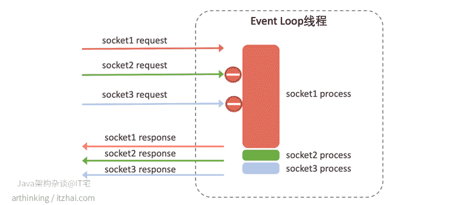

# 分析eventLoop

## 1. 阻塞


- 概述

IO指的就是硬盘文件(open/read/write)的读写、网卡(socket/read/write)等外部设备的读写、键盘、鼠标输入/屏幕输出.....

通常可以分为两类: 块设备(block device)和字符设备(character device)。 块设备将信息存储在固定大小的块中， 每个块有自己的地址， 例如硬盘， U盘。 字符设备以字符为单位发送或者接收一个字符流， 不考虑任何块结构。 字符设备是不可寻址的， 也没有任何的寻道操作， 例如网卡

直接存取: CPU发出指令,将磁盘中的某个数据读入内存，磁盘的设备控制器接受到指令后，对磁盘进行磁臂调度,并读取数据到设备缓冲区,校验通过后传至内存中

由于CPU、内存和磁盘之间的处理速度有着巨大的差异，从发出指令开始，到数据写入内存，对于CPU而言，可能过了几年之久。。。

当CPU要读取文件时， 对DMA控制器中的寄存器进行编程， 将要读的文件地址， 字节数等数据传入DMA控制器寄存器中。 此时CPU进行进程或者是线程切换， 调度其它任务的执行。

DMA控制器接收指令后向磁盘设备控制器请求数据， 并要求磁盘将数据写入到内存的一块区域内。

磁盘设备控制器调用磁盘驱动程序进行数据读取， 在磁盘缓冲区组装并检验完成后， 通过总线将数据写入内存中。

写入完成后磁盘设备控制器通过总线向DMA发送信号， 告之以完成相关操作。

DMA控制器发起硬件中断， 如果CPU此时能够处理中断， 则处理该中断， 并完成文件读操作。

多由系统自身或与链接的外设(键盘、鼠标、网卡等)产生,中断首先是处理器提供的一种响应外设请求的机制，是处理器硬件支持的特性。一个外设通过产生一种电信号通知中断控制器，中断控制器再向处理器发送响应的信号

```
+---------+   产生中断      +----------+   通知    +-----+
| 硬件设备 | -------------&gt; | 中断控制器 | -------&gt; | CPU |
+---------+                +----------+          +-----+
                                                    |
                                                    V
                                                 [中断内核]
                                                    |
                                                    V
                       [是否存在中断处理程序？] &lt;--- do_IRQ()
                                 |
                         +-------+-------+
                         |Y             N|
                         V               |
                  handle_IRQ_event       |
                         |               |
                         V               |
                   执行中断处理程序         |
                         |               V
                         +----------&gt; irq_exit ----&gt; 恢复现场 .....
```

- 大致的流程

1. CPU会把就绪状态的进程通过调度(分派CPU时间片),进程转为运行状态

2. 处于运行状态的进程在时间片用完之后，不得不让出CPU,从而转化为就绪态,剥夺了它对CPU的使用权进程与进程之间切换会产生CPU上下文切换,还额外要保存每个进程的虚拟内存

3. 当进程中有IO操作的时候,应用程序会发送软中断,INT0x80,该指令会让CPU跳转到一个预设的内核空间地址上去,进程由用户态陷入到内核态,它指向系统调用的处理函数system_call 系统调用会产生CPU上下文切换,不同的是在同一个进程中,只需要保存CPU寄存器

4. system_call根据具体的系统调用号转到执行具体的系统调用服务例程,例如sys_read(),CPU继续执行内核态中的系统调用函数

5. 当网卡没有数据到来的时候,当前内核会阻塞等待网卡的数据过来...（进程也处于阻塞的状态）,CPU因为有DMA,所以不必等待网卡的数据,可以调度其他的进程... 当前进程变为阻塞状态后便不会被调度...

6. 网卡接收到数据包的时候,会产生硬件中断,因为要快速传送数据,硬件中断会交给DMA,DMA会通知CPU恢复当前进程的调度,将当前进程由阻塞态转化为运行态(处于内核中),内核调用中断处理程序响应--内核将数据不断的读入自己的缓冲区对网卡、磁盘文件的读写会以硬中断的形式进行,快速处理

7. 内核进行协议栈的解析/数据的解封等操作，再将内核缓冲区中的数据拷贝到用户进程的缓冲区，并返回系统调用，回到用户态

代码中的任何读写文件、读写socket操作默认都是阻塞的,一旦速度较慢的话,CPU会去执行其他的进程,等IO操作结束后,再通知CPU继续执行剩余的代码...这里，CPU会在这些运行态的进程之间来回的切换....以提高CPU的利用率


```
    //接受一个客户端的连接,如果没有连接过来,阻塞在这里(三次握手阶段)
    cfd = accept(lfd,(struct sockaddr *)&clie_addr,&clie_addr_len);
    while(1){
        //   通知进程可读 <----- 内核缓冲区(协议栈解析) <--------- 网卡（解帧格式）<---- 交换机/路由器<------ 客户端数据(数据传输-请求阶段)
        //如果客户端数据迟迟没有来,也会阻塞在这里.... 
        n = read(cfd,buf,sizeof(buf));
        //程序对数据进行处理....
        for(i=0;i<n;i++){
            buf[i] = toupper(buf[i]); 
        }
        //write通知内核写入 ----> 内核缓冲区（协议栈解析） -----> 网卡（封装帧格式） -----> 交换机/路由器 ---> 客户端(数据传输-响应阶段)
        //如果客户端迟迟不读数据,内核缓冲区数据满了之后,也会阻塞在这里....
        write(cfd,buf,n);
    }
```

## 2. epoll

- select 

```js
while true {
    select(流[]);  //阻塞

    for i in 流[] {
        if i has 数据 {
            读 或者 其他处理
        }
    }
}
```
> select 代收员 比较懒，她只会告诉你快递到了，但是是谁到的，你需要挨个快递员问一遍。

- epoll 

```js
while true {
    可处理的流[] = epoll_wait(epoll_fd);  //阻塞
    for i in 可处理的流[] {
        读 或者 其他处理
   }
}
```
> 只关心“活跃”的链接，无需遍历全部描述符集合

- 创建epoll 

```c
/**
 * @param size 告诉内核监听的数目
 *
 * @returns 返回一个epoll句柄（即一个文件描述符）
 */
int epoll_create(int size);

int epfd = epoll_create(1000);
```

- 控制epoll

```c
/**
 * @param epfd 用epoll_create所创建的epoll句柄
 * @param op 表示对epoll监控描述符控制的动作
 *
 * EPOLL_CTL_ADD(注册新的fd到epfd)
 * EPOLL_CTL_MOD(修改已经注册的fd的监听事件)
 * EPOLL_CTL_DEL(epfd删除一个fd)
 *
 * @param fd 需要监听的文件描述符
 * @param event 告诉内核需要监听的事件
 *
 * @returns 成功返回0，失败返回-1, errno查看错误信息
 */
int epoll_ctl(int epfd, int op, int fd, 
            struct epoll_event *event);


struct epoll_event {
 __uint32_t events; /* epoll 事件 */
 epoll_data_t data; /* 用户传递的数据 */
}

/*
 * events : {EPOLLIN, EPOLLOUT, EPOLLPRI, 
            EPOLLHUP, EPOLLET, EPOLLONESHOT}
 */

typedef union epoll_data {
    void *ptr;
    int fd;
    uint32_t u32;
    uint64_t u64;
} epoll_data_t;


struct epoll_event new_event;

new_event.events = EPOLLIN | EPOLLOUT;
new_event.data.fd = 5;
// 
epoll_ctl(epfd, EPOLL_CTL_ADD, 5, &new_event);
```


- 等待EPOLL

```js
/**
 *
 * @param epfd 用epoll_create所创建的epoll句柄
 * @param event 从内核得到的事件集合,***结果返回***
 * @param maxevents 告知内核这个events有多大,
 *             注意: 值 不能大于创建epoll_create()时的size.
 * @param timeout 超时时间
 *     -1: 永久阻塞
 *     0: 立即返回，非阻塞
 *     >0: 指定微秒
 *
 * @returns 成功: 有多少文件描述符就绪,时间到时返回0
 *          失败: -1, errno 查看错误
 */
int epoll_wait(int epfd, struct epoll_event *event, 
            int maxevents, int timeout);

struct epoll_event my_event[1000];

int event_cnt = epoll_wait(epfd, my_event, 1000, -1);
```


- 编程实例

```c
//创建 epoll
int epfd = epoll_crete(1000);

//将 listen_fd 添加进 epoll 中
epoll_ctl(epfd, EPOLL_CTL_ADD, listen_fd,&listen_event);

while (1) {
    //阻塞等待 epoll 中 的fd 触发
    int active_cnt = epoll_wait(epfd, events, 1000, -1);

    for (i = 0 ; i < active_cnt; i++) {
        if (evnets[i].data.fd == listen_fd) {
            //accept. 并且将新accept 的fd 加进epoll中.
        }
        else if (events[i].events & EPOLLIN) {
            //对此fd 进行读操作
        }
        else if (events[i].events & EPOLLOUT) {
            //对此fd 进行写操作
        }
    }
}
```

## 3. 触发模式

- 水平触发


水平触发的主要特点是，如果用户在监听epoll事件，当内核有事件的时候，会拷贝给用户态事件，但是如果用户只处理了一次，那么剩下没有处理的会在下一次epoll_wait再次返回该事件。

这样如果用户永远不处理这个事件，就导致每次都会有该事件从内核到用户的拷贝，耗费性能，但是水平触发相对安全，最起码事件不会丢掉，除非用户处理完毕。

- 边缘触发


边缘触发，相对跟水平触发相反，当内核有事件到达， 只会通知用户一次，至于用户处理还是不处理，以后将不会再通知。这样减少了拷贝过程，增加了性能，但是相对来说，如果用户马虎忘记处理，将会产生事件丢的情况。

这就意味着，在边缘触发的模式下，只会在文件描述符的可读/可写状态发生变化的时候才会接到通知。因此，如果使用epoll的边缘触发，在收到通知的时候，必须使用非阻塞的IO，循环调用read/write多次，将数据全部度写完。

如果设置了阻塞，并且在这次读事件触发的时候，没有一次性读写完所有的数据，那么在操作系统看来，这个文件描述符没有发生变化(读 --> 读),将不会再发起通知,调用epoll_wait 会使得文件描述符一致等待，服务器也会等待客户端的响应

除了epoll_wait之外，其余的read/write都应该是非阻塞的才行

## 4. epoll服务器开发实例 -- 阻塞模式（默认）

```c
#include <stdio.h>
#include <stdlib.h>
#include <ctype.h>
#include <string.h>

#include <unistd.h>
#include <sys/types.h>
#include <sys/socket.h>
#include <arpa/inet.h>

#include <sys/epoll.h>


#define SERVER_PORT         (7778)
#define EPOLL_MAX_NUM       (2048)
#define BUFFER_MAX_LEN      (4096)

char buffer[BUFFER_MAX_LEN];

void str_toupper(char *str)
{
    int i;
    for (i = 0; i < strlen(str); i ++) {
        str[i] = toupper(str[i]);
    }
}

int main(int argc, char **argv)
{
    int listen_fd = 0;
    int client_fd = 0;
    struct sockaddr_in server_addr;
    struct sockaddr_in client_addr;
    socklen_t           client_len;

    int epfd = 0;
    struct epoll_event event, *my_events;

    // 创建我的socket:listenFd
    listen_fd = socket(AF_INET, SOCK_STREAM, 0);

    // bind
    server_addr.sin_family = AF_INET;
    server_addr.sin_addr.s_addr = htonl(INADDR_ANY);
    server_addr.sin_port = htons(SERVER_PORT);
    bind(listen_fd, (struct sockaddr*)&server_addr, sizeof(server_addr));

    // listen
    listen(listen_fd, 10);

    // epoll create
    epfd = epoll_create(EPOLL_MAX_NUM);
    if (epfd < 0) {
        perror("epoll create");
        goto END;
    }

    // listen_fd -> 添加到epoll 
    event.events = EPOLLIN;
    event.data.fd = listen_fd;
    if (epoll_ctl(epfd, EPOLL_CTL_ADD, listen_fd, &event) < 0) {
        perror("epoll ctl add listen_fd ");
        goto END;
    }
    // 创建一个myEvent的大数组，接收返回结果的大数组
    my_events = (epoll_event *)malloc(sizeof(struct epoll_event) * EPOLL_MAX_NUM);
    

    while (1) {
        // epoll wait ----> my_events
        int active_fds_cnt = epoll_wait(epfd, my_events, EPOLL_MAX_NUM, -1);
        int i = 0;
        for (i = 0; i < active_fds_cnt; i++) {
            // if fd == listen_fd
            if (my_events[i].data.fd == listen_fd) {
                //accept
                client_fd = accept(listen_fd, (struct sockaddr*)&client_addr, &client_len);
                if (client_fd < 0) {
                    perror("accept");
                    continue;
                }

                char ip[20];
                printf("new connection[%s:%d]\n", inet_ntop(AF_INET, &client_addr.sin_addr, ip, sizeof(ip)), ntohs(client_addr.sin_port));

                event.events = EPOLLIN | EPOLLET;
                event.data.fd = client_fd;
                // 添加到红黑树的节点上
                epoll_ctl(epfd, EPOLL_CTL_ADD, client_fd, &event);
            }
            else if (my_events[i].events & EPOLLIN) {
                printf("EPOLLIN\n");
                client_fd = my_events[i].data.fd;

                // do read

                buffer[0] = '\0';
                int n = read(client_fd, buffer, 5);
                if (n < 0) {
                    perror("read");
                    continue;
                }
                else if (n == 0) {
                    epoll_ctl(epfd, EPOLL_CTL_DEL, client_fd, &event);
                    close(client_fd);
                }
                else {
                    printf("[read]: %s\n", buffer);
                    buffer[n] = '\0';
#if 1
                    str_toupper(buffer);
                    // 服务器将返回结果写回去
                    write(client_fd, buffer, strlen(buffer));
                    printf("[write]: %s\n", buffer);
                    memset(buffer, 0, BUFFER_MAX_LEN);
#endif

/*
                    event.events = EPOLLOUT;
                    event.data.fd = client_fd;
                    epoll_ctl(epfd, EPOLL_CTL_MOD, client_fd, &event);
*/
                }
            }
            else if (my_events[i].events & EPOLLOUT) {
                printf("EPOLLOUT\n");
/*
                client_fd = my_events[i].data.fd;
                str_toupper(buffer);
                write(client_fd, buffer, strlen(buffer));
                printf("[write]: %s\n", buffer);
                memset(buffer, 0, BUFFER_MAX_LEN);

                event.events = EPOLLIN;
                event.data.fd = client_fd;
                epoll_ctl(epfd, EPOLL_CTL_MOD, client_fd, &event);
*/
            }
        }
    }

END:
    close(epfd);
    close(listen_fd);
    return 0;
}
```


## 5. epoll 反应堆模型

- 传统的epoll服务器

监听可读事件(ET) ⇒ 数据到来 ⇒ 触发读事件 ⇒
epoll_wait()返回 ⇒ read消息 ⇒ write回射信息（读完就直接写回了） ⇒ 继续epoll_wait()
⇒ 直到程序停止前都是这么循环

- epoll反应堆服务器模型

监听可读事件(ET) ⇒ 数据到来 ⇒ 触发事件 ⇒ epoll_wait()返回 ⇒
读取完数据(可读事件回调函数内) ⇒ 将该节点从红黑树上摘下(可读事件回调函数内) ⇒ 设置可写事件和对应可写回调函数(可读事件回调函数内) ⇒ 挂上树(可读事件回调函数内) ⇒ 处理数据(可读事件回调函数内)


⇒ 监听可写事件(ET) ⇒ 对方可读 ⇒ 触发事件 ⇒ epoll_wait()返回 ⇒
写完数据(可写事件回调函数内) ⇒ 将该节点从红黑树上摘下(可写事件回调函数内) ⇒ 设置可读事件和对应可读回调函数(可写读事件回调函数内) ⇒ 挂上树(可写事件回调函数内) ⇒ 处理收尾工作(可写事件回调函数内) ⇒ 直到程序停止前一直这么交替循环 

至此，结束

## 6. epoll的反应堆模型实现

```c
#include <stdlib.h>
#include <stdio.h>
#include <sys/socket.h>
#include <arpa/inet.h>
#include <fcntl.h>
#include <unistd.h>
#include <errno.h>
#include <string.h>
#include <time.h>
#define MAX_EVENTS 1024
#define BUFLEN 128
#define SERV_PORT 8080
// 事件的结构体
struct myevent_s {
    int fd;  // cfd,listenfd
    int events;
    void *arg; // 指向自己结构体的指针
    void (*call_back)(int fd,int events, void *arg);
    int status;
    char buf[BUFLEN];
    int len;
    long last_active;
}
int g_efd;
// 事件数组
struct myevent_s g_events[MAX_EVENTS + 1] /* +1 最后一个用于 listen fd */
// 设置事件的函数
void eventset(struct myevnet_s *ev,int fd, void(*call_back)(int, int, void *),void *arg){
    ev->fd = fd;
    ev->call_back = call_back;
    ev->events = 0;
    ev->arg = arg;
    ev->status = 0;
    ev->last_active = time(NULL);
    return;
}
void recvdata(int fd, int events, void *arg);
void senddata(int fd, int events, void *arg);

void eventadd(int efd,int events,struct myevent_s *ev){
    // 创建一个epoll 节点 , epoll_event对象作为最后一个参数
    struct epoll_event epv = {0,{0}};
    int op;
    epv.data.ptr = ev; // 指针指向我们的事件的数组
    epv.events = ev->events = events; // events : EPOLLIN, EPOLLOUT, EPOLLPRI
    if(ev->status == 1){
        op = EPOLL_CTL_MOD
    }else{
        op = EPOLL_CTL_ADD
        ev->status = 1;
    }
    if (epoll_ctl(efd, op, ev->fd, &epv) < 0)
        printf("event add failed [fd=%d], events[%d]\n", ev->fd, events);
    else
        printf("event add OK [fd=%d], op=%d, events[%0X]\n", ev->fd, op, events);

    return;
}
void eventdel(int efd, struct myevent_s *ev)
{
    // 删除我们的epoll节点
    struct epoll_event epv = {0, {0}};

    if (ev->status != 1)
        return;

    epv.data.ptr = ev;
    ev->status = 0;
    epoll_ctl(efd, EPOLL_CTL_DEL, ev->fd, &epv);
    return;
}
void acceptconn(int lfd,int events,void *arg){
    struct sockaddr_in cin;
    socklen_t len = sizeof(cin);
    inf cfd,i;
    if((cfd = accept(lfd, (struct sockaddr *)&cin, &len)) == -1) {
        if (errno != EAGAIN && errno != EINTR) {
            /* 暂时不做出错处理 */
        }
        printf("%s: accept, %s\n", __func__, strerror(errno));
        return;
    }
    do {
        for(i = 0;i<MAX_EVNETS;i++){
            // 循环我的事件数组
            if(g_events[i].status == 0) break;
            if(i == MAX_EVENTS){
                printf("%s: max connect limit[%d]\n", __func__, MAX_EVENTS);
            break;
            }
            int flag = 0;
            if ((flag = fcntl(cfd, F_SETFL, O_NONBLOCK)) < 0)
        {
            // 将accept客户端请求clientfd设置为非阻塞模式,配合epoll边缘触发
            printf("%s: fcntl nonblocking failed, %s\n", __func__, strerror(errno));
            break;
        }
        // 设置我们的事件对象
        eventset(&g_events[i], cfd, recvdata, &g_events[i]);
        // accept的时候,将当前客户端的请求节点加入到事件数组中
        eventadd(g_efd, EPOLLIN, &g_events[i]);
        }
    }while(0)
    printf("new connect [%s:%d][time:%ld], pos[%d]\n", inet_ntoa(cin.sin_addr), ntohs(cin.sin_port), g_events[i].last_active, i);

    return;
}
// 接收数据
void recvdata(int fd,int events,void *arg){
    struct myevent_s *ev = (struct myevent_s *)arg;
    int len;

    len = recv(fd, ev->buf, sizeof(ev->buf), 0);
    eventdel(g_efd, ev);

    if (len > 0) {
        ev->len = len;
        ev->buf[len] = '\0';
        printf("C[%d]:%s\n", fd, ev->buf);
        /* 转换为发送事件 */
        eventset(ev, fd, senddata, ev);
        eventadd(g_efd, EPOLLOUT, ev);
    }
    else if (len == 0) {
        close(ev->fd);
        /* ev-g_events 地址相减得到偏移元素位置 */
        printf("[fd=%d] pos[%d], closed\n", fd, (int)(ev - g_events));
    }
    else {
        close(ev->fd);
        printf("recv[fd=%d] error[%d]:%s\n", fd, errno, strerror(errno));
    }

    return;

}
// 发送数据
void senddata(int fd, int events, void *arg){
    struct myevent_s *ev = (struct myevent_s *)arg;
    int len;

    len = send(fd, ev->buf, ev->len, 0);
    //printf("fd=%d\tev->buf=%s\ttev->len=%d\n", fd, ev->buf, ev->len);
    //printf("send len = %d\n", len);

    eventdel(g_efd, ev);
    if (len > 0) {
        printf("send[fd=%d], [%d]%s\n", fd, len, ev->buf);
        eventset(ev, fd, recvdata, ev);
        eventadd(g_efd, EPOLLIN, ev);
    }
    else {
        close(ev->fd);
        printf("send[fd=%d] error %s\n", fd, strerror(errno));
    }

    return;
}
// 初始化
void initlistensocket(int efd, short port){
    int lfd = socket(AF_INET, SOCK_STREAM, 0);
    // 这里，具体为什么高性能的服务器要将服务端的listen设置成非阻塞模式，原因有：
    // 
    fcntl(lfd, F_SETFL, O_NONBLOCK); // 将listenfd设置为非阻塞模式
    eventset(&g_events[MAX_EVENTS], lfd, acceptconn, &g_events[MAX_EVENTS]);
    eventadd(efd, EPOLLIN, &g_events[MAX_EVENTS]);

    struct sockaddr_in sin;

    memset(&sin, 0, sizeof(sin));
    sin.sin_family = AF_INET;
    sin.sin_addr.s_addr = INADDR_ANY;
    sin.sin_port = htons(port);

    bind(lfd, (struct sockaddr *)&sin, sizeof(sin));
    listen(lfd, 20);
    return;
}
int main(int argc, char *argv[]) {
    unsigned short port = SERV_PORT;

    if (argc == 2)
        port = atoi(argv[1]);

    g_efd = epoll_create(MAX_EVENTS+1);

    if (g_efd <= 0)
        printf("create efd in %s err %s\n", __func__, strerror(errno));
    // 初始化listenfd
    initlistensocket(g_efd, port);

    /* 事件循环 */
    struct epoll_event events[MAX_EVENTS+1];

    printf("server running:port[%d]\n", port);
    int checkpos = 0, i;
    while (1) {
        /* 超时验证，每次测试100个链接，不测试listenfd 当客户端60秒内没有和服务器通信，则关闭此客户端链接 */
        long now = time(NULL);
        for (i = 0; i < 100; i++, checkpos++) {
            if (checkpos == MAX_EVENTS)
                checkpos = 0;
            if (g_events[checkpos].status != 1)
                continue;
            long duration = now - g_events[checkpos].last_active;
            if (duration >= 60) {
                close(g_events[checkpos].fd);
                printf("[fd=%d] timeout\n", g_events[checkpos].fd);
                eventdel(g_efd, &g_events[checkpos]);
            }
        }
        /* 等待事件发生 */
        int nfd = epoll_wait(g_efd, events, MAX_EVENTS+1, 1000);
        if (nfd < 0) {
            printf("epoll_wait error, exit\n");
            break;
        }
        for (i = 0; i < nfd; i++) {
            struct myevent_s *ev = (struct myevent_s *)events[i].data.ptr;
            // 发生了可读事件的时候 ,包括accept /read 
            if ((events[i].events & EPOLLIN) && (ev->events & EPOLLIN)) {
                ev->call_back(ev->fd, events[i].events, ev->arg);
            }
            // 发生了可写事件的时候 write
            if ((events[i].events & EPOLLOUT) && (ev->events & EPOLLOUT)) {
                ev->call_back(ev->fd, events[i].events, ev->arg);
            }
        }
    }
    /* 退出前释放所有资源 */
    return 0;
}
```


## 7. 浏览器端的eventLoop 


- 在V8引擎中运行JS代码，运行过程中，产生的对象分配在堆中；
- 每当有一个新的方法调用，都会在栈中产生一个新的栈帧Frame，执行完则从栈中弹出，这和JVM虚拟机的运行类似；
- 栈帧可能会触发一个外部API[5]的调用，进而触发在事件队列中加入各种回调事件；
- 在浏览器，每当一个事件发生并有一个事件监听器绑定在该事件上的时候，一个事件消息就会被添加到消息队列中。例如点击了一个按钮元素，就会把这个按钮元素的点击操作封装成事件添加到消息队列中；
JavaScript的事件循环模型永不阻塞。 处理 I/O 通常通过事件和回调来执行；

只要栈中的代码执行完毕，Event Loop主线程就会去读取事件队列，依次执行那些已完成事件所对应的回调函数。

> 同步代码执行完毕，轮询查看事件队列，依次进行执行


## 8. Node层面的evetLoop


- V8引擎解析JS脚本，调用Node API
- libuv库执行Node API，会先将API请求封装成事件，放入事件队列，Event Loop线程处于空闲状态时，就开始遍历处理事件队列中的事件，对事件进行处理：
- 如果不是阻塞任务，直接处理得到结果，通过回调函数返回给V8；
- 如果是阻塞任务，则从Worker线程池中取出一个线程，交给线程处理，最终线程把处理结果设置到事件的结果属性中，把事件放回事件队列，等待Event Loop线程执行回调返回给V8引擎。

Node.js适合请求和响应内容小，无需大量计算逻辑的场景，这能够充分发挥Node.js运行模式的优势。类似的场景有聊天程序。

从以上分析可知，Node.js通过事件驱动，把阻塞的IO任务丢到线程池中进行异步处理，也就是说，Node.js适合I/O密集型任务。

但是，如果碰到CPU密集型任务的时候，Node.js中的EventLoop线程就会自己处理任务，这样会导致在事件队列中的CPU密集型任务没有处理完，那么后面的任务就不会被执行到了，从而导致后续的请求响应变慢。

如下图，本来socket2和socket3很快就可以处理完的，但是由于socket1的任务一直占用着CPU时间，导致socket2和socket3都不能及时得到处理，从表现上看，就是响应变慢了。




## 9. redis0.1启动代码分析

### 内存分配 -- zmalloc.c

可以借鉴redis中的内存分配的原则

```c
#include <stdlib.h>
#include <string.h>

// 通常我们用sizeOf得到的结果就是size_t类型
// 并且,通常情况下,32位的操作系统size_t 是32位
static size_t used_momory = 0;

void *zmalloc(size_t size) {
    void *ptr = malloc(size + sizeof(size_t));
    if(!ptr) return NULL;
    *((size_t*)ptr) = size;
    used_memory += size + sizeof(size_t);
    return (char *)ptr + sizeof(size_t);
}

void *zrealloc(void *ptr,size_t size){
    void *realptr;
    size_t oldsize;
    void *newptr;
    // ptr未空的话即没有旧数据，直接申请一块内存即可
    if(ptr == NULL) return zmalloc(size)
    // 旧数据占据的内存大小
    realptr = (char*)ptr - sizeof(size_t);
    // 得到数据部分的内存大小
    oldsize = *((size_t*)realptr);
    // 以旧数据的内存地址为基地址，重新分配size + sizeof(size_t)大小的内存
    newptr = realloc(realptr,size+sizeof(size_t));
    if(!newptr) return NULL
    // 记录数据部分的内存大小
    *((size_t*)newptr) = size;
    // 重新计算已分配内存的总大小,sizeof(size_t)仍然在使用
    used_momory -= oldsize;
    used_momory += size;
    // 返回存储数据的内存首地址
    return (char*)newptr + sizeof(size_t);
}

void zfree(void *ptr){
    void *realptr;
    size_t oldsize;
    if(ptr == NULL) return;
    // 算出真正的内存首地址
    realptr = (char*)ptr - sizeof(size_t);
    oldsize = *((size_t*)realptr);
    // 减去释放的内存大小
    used_memory -= oldsize + sizeof(size_t);
    free(realptr);
}
```


### 字典  --- dict.c 


字典也叫哈希表,看一下redis的实现,申请一个指针数组，然后每个元素指向一个链表用来存储数据

哈希表： 数组 + 链表list


- table 哈希表的数组,数组中的每个元素都是指针，指向dictEntry结构
- size 哈希表的大小,table数组的大小
- sizemask 哈希表掩码，用户计算索引，等于size -1
- used 还细胞已有节点的数量

> dictEntry结构里的属性next就是解决哈希键冲突问题的，有冲突的值，就用链表来记录下一个值

1. 创建一个字典

```c
// 申请一个表示字典的数据结构
dict *dictCreate(dictType *type,void *privDataPtr){
    dict *ht = _dictAlloc(sizeof(*ht))
    _dictInit(ht,type,privDataPtr)
    return ht;
}

// 初始化字段数据结构
int _dictInit(dict *ht,dictType *type,void *privDataptr){
    _dictReset(ht);
    ht->type = type;
    ht->privdata = privDataPtr;
    return DICT_OK;
}

// 扩容
int dictResize(dict *ht){
    int minimal = ht->used;
    if(minimal < DICT_HT_INITIAL_SIZE)
        minimal = DICT_HT_INITIAL_SIZE;
    return dictExpand(ht,minimal)    
}
```


2. 往字典加入一个元素

```c
int dictAdd(dict *ht, void *key, void *val){
    int index;
    dictEntry *entry;
    // 计算key是否已经存在，不存在则返回key对应的索引
    if(((index = _dictKeyIndex(ht,key)) == -1) return DICT_ERR;
    // 首先申请一个dictEntry 字典项
    entry = _dictAlloc(sizeof(*entry));
    // 头插法插入第index项对应的链表
    // tabel[index] dictEntry对象
    entry->next = ht->table[index]
    ht->table[index] = entry
    // 设置键值
    dictSetHashKey(ht,entry,key)
    dictSetHashVal(ht,entry,val)
    // 节点+1
    ht->used++
    return DICT_OK
}

// 首先判断key是否存在，存在就无法添加
// 根据key和哈希函数，计算对应的索引
// 头插法插入对应索引的链表

```

下面我们来看下如何来计算索引值


```c
static int _dictKeyIndex(dict *ht, const void *key){
    unsigned int h;
    dictEntry *he;

    /* Expand the hashtable if needed */
    if (_dictExpandIfNeeded(ht) == DICT_ERR)
        return -1;
    // 计算出来的hash索引
    h = dictHashKey(ht, key) & ht->sizemask;
    /* Search if this slot does not already contain the given key */
    he = ht->table[h];
    while(he) {
        if (dictCompareHashKeys(ht, key, he->key))
            return -1;
        he = he->next;
    }
    return h;
}
```
首先判断下是否需要dictExpand开辟保存数据的内存

```c
static int _dictExpandIfNeeded(dict *ht)
{
    // 假设哈希表的大小是0的话，则调用dictExpand扩容 16
    if (ht->size == 0)
        return dictExpand(ht, DICT_HT_INITIAL_SIZE);
    // 假设哈希表的大小已经达到了使用的大小了,则进行扩容  - 扩充一倍大小
    // 如果要扩充的数字小于16（默认值）的话，那我们就计算一个大于等于16并且是2的倍数的值
    if (ht->used == ht->size)
        return dictExpand(ht, ht->size*2);
    return DICT_OK;
}

// 扩容函数
int dictExpand(dict *ht, unsigned long size){
    // 新建的哈希表
    dict n;
    // size是数组元素的个数，2的倍数
    unsigned long realsize = _dictNextPower(size),i;
    _dictInit(&n,ht->type,ht->privdata)
    // 哈希表数组的长度
    n.size = realsize;
    // 索引掩码，用于计算索引
    n.sizemask = realsize - 1;
    // 用做哈希表的指针数组
    n.table = _dictAlloc(realsize*sizeof(dictEntry*))
    // 初始化内存为0
    memset(n.table,0,realsize*sizeof(dictEntry*))
    // 之前字典里面已经使用过的，复制过来,used是字典节点个数
    n.used = ht->used;
    for(i=0;i < ht->size && ht->used > 0;i++){
        dictEntry *he,*nextHe;
        // 空项,不需要复制
        if(ht->table[i] == NULL) continue;
        he = ht->table[i];
        while(he){
            unsigned int h;
            // 保存下一个节点的地址，table的每一个项都是一个链表
            nextHe = he->next;
            // 重新计算he的索引
            h = dictHashKey(ht,he->key) & n.sizemask;
            // 插入索引为h的字典项中，头插法,n.table[h]是整个table链表的头
            he->next = n.table[h];
            n.table[h] = he;
            // 使用数减1,复制完毕后ht->userd == 0
            ht->used --;
            he = nextHe;
        }
    }
    assert(ht->used == 0)
    // 释放旧的内存
    _dictFree(ht->table);
    // 覆盖之前的信息
    *ht = n;
    return DICT_OK;
}
```

3. 修改某个key对应的值

```c

int dictReplace(dict *ht, void *key, void *val)
{
    dictEntry *entry;
    // 尝试新增，成功说明之前还没有这个key，否则说明存在，下面再替换
    if (dictAdd(ht, key, val) == DICT_OK)
        return DICT_OK;
    // 找到key对应的索引
    entry = dictFind(ht, key);
    // 释放当前的value
    dictFreeEntryVal(ht, entry);
    // 重新设置新值
    dictSetHashVal(ht, entry, val);
    return DICT_OK;
}
```

4. 删除一个元素

```c
static int dictGenericDelete(dict *ht, const void *key, int nofree)
{
    unsigned int h;
    dictEntry *he, *prevHe;
    // 空字典
    if (ht->size == 0)
        return DICT_ERR;
    // 算出索引
    h = dictHashKey(ht, key) & ht->sizemask;
    // 拿到索引对应的链表
    he = ht->table[h];

    prevHe = NULL;
    while(he) {
        // 比较key，找到返回true
        if (dictCompareHashKeys(ht, key, he->key)) {
            /* Unlink the element from the list */
            // 上一个不匹配节点的next指针指向待删除节点的下一个节点
            if (prevHe)
                prevHe->next = he->next;
            else
                // prevHe为空，说明待删除的节点是链表的第一个节点，则更新头指针指向待删除节点的下一个
                ht->table[h] = he->next;
            // 
            if (!nofree) {
                dictFreeEntryKey(ht, he);
                dictFreeEntryVal(ht, he);
            }
            // 删除这个节点
            _dictFree(he);
            // 已使用个数减一
            ht->used--;
            return DICT_OK;
        }
        // 保存上一个不匹配的
        prevHe = he;
        he = he->next;
    }
    return DICT_ERR; /* not found */
}


```

5. 查找

```c
dictEntry *dictFind(dict *ht, const void *key)
{
    dictEntry *he;
    unsigned int h;

    if (ht->size == 0) return NULL;
    // 自定义的哈希函数钩子
    h = dictHashKey(ht, key) & ht->sizemask;
    he = ht->table[h];
    while(he) {
    	// 自定义的比较函数钩子
        if (dictCompareHashKeys(ht, key, he->key))
            return he;
        he = he->next;
    }
    return NULL;
}


// 哈希函数
unsigned int dictGenHashFunction(const unsigned char *buf, int len) {
    unsigned int hash = 5381;

    while (len--)
        hash = ((hash << 5) + hash) + (*buf++); /* hash * 33 + c */
    return hash;
}
// 比较函数
static int _dictStringCopyHTKeyCompare(void *privdata, const void *key1,
        const void *key2)
{
    return strcmp(key1, key2) == 0;
}

```

总的流程就是根据key产生一个索引，然后根据索引到哈希表中取得对应的一个链表，然后操作这个链表(新增、查找、删除)


6. 销毁字典

```c
// 销毁整个字典
int _dictClear(dict *ht)
{
    unsigned long i;

    /* Free all the elements */
    for (i = 0; i < ht->size && ht->used > 0; i++) {
        dictEntry *he, *nextHe;
        // 空闲项，跳过
        if ((he = ht->table[i]) == NULL) continue;
        // 
        while(he) {
            // 先保存下一个节点地址，不然下面内存被释放就找不到了
            nextHe = he->next;
            // 释放键内存
            dictFreeEntryKey(ht, he);
            // 释放值内存
            dictFreeEntryVal(ht, he);
            // 释放节点内存
            _dictFree(he);
            // 使用数减一
            ht->used--;
            he = nextHe;
        }
    }
    /* Free the table and the allocated cache structure */
    // 释放字典结构体
    _dictFree(ht->table);
    /* Re-initialize the table */
    // 重置字段
    _dictReset(ht);
    return DICT_OK; /* never fails */
}
```


7. 迭代字典


```c
// 申请字典迭代器
dictIterator *dictGetIterator(dict *ht)
{
    dictIterator *iter = _dictAlloc(sizeof(*iter));

    iter->ht = ht;
    iter->index = -1;
    iter->entry = NULL;
    iter->nextEntry = NULL;
    return iter;
}
// 迭代字典的元素，每次调用返回一个节点
dictEntry *dictNext(dictIterator *iter)
{
    while (1) {
        // 初始化时entry为NULL
        if (iter->entry == NULL) {
            iter->index++;
            // 到底了才break，而不是entry为空
            if (iter->index >=
                    (signed)iter->ht->size) break;
            // 返回索引为0对应的链表
            iter->entry = iter->ht->table[iter->index];
        } else {
            iter->entry = iter->nextEntry;
        }
        // 还有节点，则同时记录下一个节，返回entry节点
        if (iter->entry) {
            iter->nextEntry = iter->entry->next;
            return iter->entry;
        }
    }
    return NULL;
}
```

基本的逻辑就是，按照哈希表数组的索引，从小到大，每一个索引，先去遍历他对应的链表，遍历完后，继续下一个索引，直到最后一个索引结束。


###  链表


1. 新建一个链表

```c
// 新建一个链表头节点
list *listCreate(void){
    struct list *list;
    if((list = zmalloc(sizeof(*list))) == NULL)
        return NULL
    // 空链表,还没有节点
    list->head = list->tail = NULL;
    // 链表中的节点数
    list->len = 0;
    // 复制节点的函数
    list->dup = NULL;
    // 释放节点
    list->free = NULL;
    // 匹配节点的函数
    list->match = NULL;
    return list;
}
```

2. 释放一个链表

```c
// 释放一个链表
void listRelease(list *list)
{
    unsigned int len;
    listNode *current, *next;
    // 第一个节点
    current = list->head;
    // 链表中的节点数
    len = list->len;
    while(len--) {
        next = current->next;
        // 定义了free函数，则执行
        if (list->free) list->free(current->value);
        // 释放节点内存
        zfree(current);
        current = next;
    }
    // 释放链表内存
    zfree(list);
}
```

3. 插入一个节点(支持头插和尾插)

```c
// 给链表新增一个节点，头插法
list *listAddNodeHead(list *list, void *value)
{
    listNode *node;
    // 分配一个新的listNode节点
    if ((node = zmalloc(sizeof(*node))) == NULL)
        return NULL;
    node->value = value;
    // 插入的是第一个节点
    if (list->len == 0) {
        // 头尾指针指向第一个节点
        list->head = list->tail = node;
        // 第一个节点前后指针为空
        node->prev = node->next = NULL;
    } else {
        // 插入的不是第一个节点，头插法
        node->prev = NULL;
        node->next = list->head;
        list->head->prev = node;
        list->head = node;
    }
    // 节点数加一
    list->len++;
    return list;
}

// 给链表新增一个节点，尾插法
list *listAddNodeTail(list *list, void *value)
{
    listNode *node;

    if ((node = zmalloc(sizeof(*node))) == NULL)
        return NULL;
    node->value = value;
    if (list->len == 0) {
        list->head = list->tail = node;
        node->prev = node->next = NULL;
    } else {
        node->prev = list->tail;
        node->next = NULL;
        list->tail->next = node;
        list->tail = node;
    }
    list->len++;
    return list;
}
```

4. 删除节点

```c
// 删除节点node
void listDelNode(list *list, listNode *node)
{
    // 有前指针说明不是第一个节点，则前节点的next指针指向node的第一个节点
    if (node->prev)
        node->prev->next = node->next;
    else
        // 前指针为空说明是第一个节点，更新头节点头指针的指向，指向node的下一个节点
        list->head = node->next;
    // next非空说明不是最后一个节点，更新node下一个节点的前指针为node的前一个节点
    if (node->next)
        node->next->prev = node->prev;
    else
        // 删除的是最后一个节点，则更新头节点尾指针的指向
        list->tail = node->prev;
    // 定义了free函数
    if (list->free) list->free(node->value);
    // 释放节点的内存
    zfree(node);
    // 节点数减一
    list->len--;
}

```

5. 查找


```c
// 返回链表的第index个字节
listNode *listIndex(list *list, int index) {
    listNode *n;
    // index小于0，则-1是最后一个节点
    if (index < 0) {
        /*
                    |
            ---------------------
                    |
         -2   -1    0   1   2
        假设index=-2，-index则为2，-index-1则为1。即向前走1个节点，
        因为初始化时n指向了尾节点，所以这时候返回的是倒数第二个节点
        */  
        index = (-index)-1;
        n = list->tail;
        while(index-- && n) n = n->prev;
    } else {
        // 索引为0对应的节点（第一个节点），如果只有2个节点，index大于节点数，则返回最后一个节点
        n = list->head;
        while(index-- && n) n = n->next;
    }
    return n;
}

```

通过键查找

```c
// 遍历链表，查找key对应的节点
listNode *listSearchKey(list *list, void *key)
{
    listIter *iter;
    listNode *node;

    iter = listGetIterator(list, AL_START_HEAD);
    while((node = listNext(iter)) != NULL) {
        // 定义了match函数
        if (list->match) {
            if (list->match(node->value, key)) {
                listReleaseIterator(iter);
                return node;
            }
        } else {
            // 默认比较内存地址
            if (key == node->value) {
                listReleaseIterator(iter);
                return node;
            }
        }
    }
    listReleaseIterator(iter);
    return NULL;
}
```

6. 复制一个链表


```c
// 复制一个链表
list *listDup(list *orig)
{
    list *copy;
    listIter *iter;
    listNode *node;
    // 申请一个新的链表头节点
    if ((copy = listCreate()) == NULL)
        return NULL;
    copy->dup = orig->dup;
    copy->free = orig->free;
    copy->match = orig->match;
    // 申请一个链表迭代器
    iter = listGetIterator(orig, AL_START_HEAD);
    while((node = listNext(iter)) != NULL) {
        void *value;
        // 定义了复制函数，比如深度复制
        if (copy->dup) {
            value = copy->dup(node->value);
            // 复制出错，释放刚才申请的内存
            if (value == NULL) {
                listRelease(copy);
                listReleaseIterator(iter);
                return NULL;
            }
        } else
            // 默认浅复制
            value = node->value;
        // 插入新的链表
        if (listAddNodeTail(copy, value) == NULL) {
            listRelease(copy);
            listReleaseIterator(iter);
            return NULL;
        }
    }
    // 用完了，释放迭代器
    listReleaseIterator(iter);
    return copy;
}
```

7. 迭代链表

```c
// 申请一个链表迭代器
listIter *listGetIterator(list *list, int direction)
{
    listIter *iter;
    
    if ((iter = zmalloc(sizeof(*iter))) == NULL) return NULL;
    // 从头还是从尾开始遍历
    if (direction == AL_START_HEAD)
        iter->next = list->head;
    else
        iter->next = list->tail;
    iter->direction = direction;
    return iter;
}


// 一次迭代，返回链表中的一个节点
listNode *listNext(listIter *iter)
{
    listNode *current = iter->next;

    if (current != NULL) {
        if (iter->direction == AL_START_HEAD)
            iter->next = current->next;
        else
            iter->next = current->prev;
    }
    return current;
}
```


### 事件驱动


1. eventLoop创建

```c
struct aeEventLoop {
    // 定时器的id,每创建一个定时器结构体,就加1
    long long timeEventNextId;
    // 两个链表
    aeFileEvent *fileEventHead;
    aeTimeEvent *timeEventHead;
    int stop;
}aeEventLoop

struct afFileEvent {
    int fd;
    int mask;
    aeFileProc *fileProc;
     aeEventFinalizerProc *finalizerProc;
    void *clientData;
    struct aeFileEvent *next;
}

struct aeTimeEvent {
    long long id; /* time event identifier. */
    long when_sec; /* seconds */
    long when_ms; /* milliseconds */
    aeTimeProc *timeProc;
    aeEventFinalizerProc *finalizerProc;
    void *clientData;
    struct aeTimeEvent *next;
} aeTimeEvent;


aeEventLoop *aeCreateEventLoop(void) {
    aeEventLoop *eventLoop;
    eventLoop = zmalloc(sizeof(*eventLoop));
    if (!eventLoop) return NULL;
    eventLoop->fileEventHead = NULL;
    eventLoop->timeEventHead = NULL;
    eventLoop->timeEventNextId = 0;
    eventLoop->stop = 0;
    return eventLoop;
}

```


2. 创建TCP服务器

```c
int anetTcpServer(char *err, int port, char *bindaddr)
{
    int s, on = 1;
    struct sockaddr_in sa;
    // 创建一个socket(domain,type,protocol)
    if ((s = socket(AF_INET, SOCK_STREAM, 0)) == -1) {
        anetSetError(err, "socket: %s\n", strerror(errno));
        return ANET_ERR;
    }
    // 端口复用
    if (setsockopt(s, SOL_SOCKET, SO_REUSEADDR, &on, sizeof(on)) == -1) {
        anetSetError(err, "setsockopt SO_REUSEADDR: %s\n", strerror(errno));
        close(s);
        return ANET_ERR;
    }
    memset(&sa,0,sizeof(sa));
    sa.sin_family = AF_INET;
    sa.sin_port = htons(port);
    sa.sin_addr.s_addr = htonl(INADDR_ANY);
    if (bindaddr) {
        if (inet_aton(bindaddr, &sa.sin_addr) == 0) {
            anetSetError(err, "Invalid bind address\n");
            close(s);
            return ANET_ERR;
        }
    }
    // 绑定 bind(socktfd, addr,addrlen)
    if (bind(s, (struct sockaddr*)&sa, sizeof(sa)) == -1) {
        anetSetError(err, "bind: %s\n", strerror(errno));
        close(s);
        return ANET_ERR;
    }
    // 监听listen(socket,backlog)排队建立3次握手队列和刚刚建立3次握手队里的总和
    if (listen(s, 32) == -1) {
        anetSetError(err, "listen: %s\n", strerror(errno));
        close(s);
        return ANET_ERR;
    }
    return s;
}

```

3. 创建redis定时任务

```c
long long aeCreateTimeEvent(aeEventLoop *eventLoop, long long milliseconds,aeTimeProc *proc,void *clientData,aeEventFinalizeProc *finalizerProc){
    // 新增一个定时器就+1
    long long id = eventLoop->timeEventNextId++;
    // 创建一个时间结构体 
    aeTimeEvent *te;
    // 分配空间
    te = zmalloc(sizeof(*te))
    if(te == NULL) return AE_ERR
    te->id = id
    aeAddMillsecondsToNow(millseconds,&te->when_sec,&te->when_ms)
    te->timeProc = proc;
    te->finalizerProc = finalizerProc;
    te->clientData = clientData;
    // 头插法插入eventLoop中的timeEventHead队列
    te->next = eventLoop->timeEventHead;
    eventLoop->timeEventHead = te;
    return id;
}   

```

时间相关的函数

```c
// 获取当前的时间，秒和毫秒
static void aeGetTime(long *seconds, long *milliseconds){
    struct timeval tv;
    gettimeofday(&tv, NULL);
    *seconds = tv.tv_sec;
    *milliseconds = tv.tv_usec/1000;
}

static void aeAddMillisecondsToNow(long long milliseconds, long *sec, long *ms) {
    long cur_sec, cur_ms, when_sec, when_ms;
    // 获取当前时间
    aeGetTime(&cur_sec, &cur_ms);
    // 绝对时间，秒数，当前时间 + 传递的时间
    when_sec = cur_sec + milliseconds/1000;
    // 绝对时间，毫秒数,当前时间 + 传递的时间
    when_ms = cur_ms + milliseconds%1000;
    // 大于一秒则进位到秒中
    if (when_ms >= 1000) {
        when_sec ++;
        when_ms -= 1000;
    }
    // 返回绝对时间的秒和毫秒
    *sec = when_sec;
    *ms = when_ms;
}

```

4.  创建一个文件相关结构体


```c
int aeCreateFileEvent(aeEventLoop *eventLoop,int fd,int mask,aeFileProc *proc,void *clientData,aeEventFinalizerProc *finalizerProc){
    aeFileEvent *fe;
    fe = zmalloc(sizeof(*fe));
    if(fe == NULL) return AE_ERR;
    fe->fd = fd;
    fe->mask = mask;
    fe->fileProc = proc;
    fe->finalizerProc = finalizerProc;
    fe->clientData = clientData;
    fe->next = eventLoop->fileEventHead;
    eventLoop->fileEventHead = fe;
    return AE_OK;
}
```

5. 最后看一下事件的处理逻辑

```c
int aeProcessEvents(aeEventLoop *eventLoop, int flags)
{
    int maxfd = 0, numfd = 0, processed = 0;
    fd_set rfds, wfds, efds;
    aeFileEvent *fe = eventLoop->fileEventHead;
    aeTimeEvent *te;
    long long maxId;
    AE_NOTUSED(flags);

    /* Nothing to do? return ASAP */
    // 两种类型的事件都不需要处理
    if (!(flags & AE_TIME_EVENTS) && !(flags & AE_FILE_EVENTS)) return 0;
    // 首先清空
    FD_ZERO(&rfds);
    FD_ZERO(&wfds);
    FD_ZERO(&efds);

    /* Check file events */
    // 处理文件事件
    if (flags & AE_FILE_EVENTS) {
        while (fe != NULL) {
            // 将对应的fd加入到select中
            if (fe->mask & AE_READABLE) FD_SET(fe->fd, &rfds);
            if (fe->mask & AE_WRITABLE) FD_SET(fe->fd, &wfds);
            if (fe->mask & AE_EXCEPTION) FD_SET(fe->fd, &efds);
            // 记录最大文件描述符select的时候需要用
            if (maxfd < fe->fd) maxfd = fe->fd;
            numfd++;
            fe = fe->next;
        }
    }
    /* Note that we want call select() even if there are no
     * file events to process as long as we want to process time
     * events, in order to sleep until the next time event is ready
     * to fire. */
    // 有文件事件需要处理，或者有time事件并且没有设置AE_DONT_WAIT（设置的话就不会进入select定时阻塞）标记
    if (numfd || ((flags & AE_TIME_EVENTS) && !(flags & AE_DONT_WAIT))) {
        int retval;
        aeTimeEvent *shortest = NULL;
        /*
            struct timeval {
                long    tv_sec;         // seconds 
                long    tv_usec;        // and microseconds 
            };
        */
        struct timeval tv, *tvp;
        // 有time事件需要处理，并且没有设置AE_DONT_WAIT标记，则select可能会定时阻塞（如果有time节点的话）
        if (flags & AE_TIME_EVENTS && !(flags & AE_DONT_WAIT))
            // 找出最快到期的节点
            shortest = aeSearchNearestTimer(eventLoop);
        // 有待到期的time节点
        if (shortest) {
            long now_sec, now_ms;

            /* Calculate the time missing for the nearest
             * timer to fire. */
            aeGetTime(&now_sec, &now_ms);
            tvp = &tv;
            // 算出相对时间，秒数
            tvp->tv_sec = shortest->when_sec - now_sec;
            // 不够，需要借位
            if (shortest->when_ms < now_ms) {
                // 微秒
                tvp->tv_usec = ((shortest->when_ms+1000) - now_ms)*1000;
                // 借一位，减一
                tvp->tv_sec --;
            } else {
                // 乘以1000，即微秒
                tvp->tv_usec = (shortest->when_ms - now_ms)*1000;
            }
        } else {
            // 没有到期的time节点
            /* If we have to check for events but need to return
             * ASAP because of AE_DONT_WAIT we need to se the timeout
             * to zero */
            // 设置了AE_DONT_WAIT，则不会阻塞在select
            if (flags & AE_DONT_WAIT) {
                tv.tv_sec = tv.tv_usec = 0;
                tvp = &tv;
            } else {
                // 一直阻塞直到有事件发生
                /* Otherwise we can block */
                tvp = NULL; /* wait forever */
            }
        }
        
        retval = select(maxfd+1, &rfds, &wfds, &efds, tvp);
        if (retval > 0) {
            fe = eventLoop->fileEventHead;
            while(fe != NULL) {
                int fd = (int) fe->fd;
                // 有感兴趣的事件发生
                if ((fe->mask & AE_READABLE && FD_ISSET(fd, &rfds)) ||
                    (fe->mask & AE_WRITABLE && FD_ISSET(fd, &wfds)) ||
                    (fe->mask & AE_EXCEPTION && FD_ISSET(fd, &efds)))
                {
                    int mask = 0;
                    // 记录发生了哪些感兴趣的事件
                    if (fe->mask & AE_READABLE && FD_ISSET(fd, &rfds))
                        mask |= AE_READABLE;
                    if (fe->mask & AE_WRITABLE && FD_ISSET(fd, &wfds))
                        mask |= AE_WRITABLE;
                    if (fe->mask & AE_EXCEPTION && FD_ISSET(fd, &efds))
                        mask |= AE_EXCEPTION;
                    // 执行回调
                    fe->fileProc(eventLoop, fe->fd, fe->clientData, mask);
                    processed++;
                    /* After an event is processed our file event list
                     * may no longer be the same, so what we do
                     * is to clear the bit for this file descriptor and
                     * restart again from the head. */
                    /*
                        执行完回调后，文件事件队列可能发生了变化，
                        重新开始遍历
                    */
                    fe = eventLoop->fileEventHead;
                    // 清除该文件描述符
                    FD_CLR(fd, &rfds);
                    FD_CLR(fd, &wfds);
                    FD_CLR(fd, &efds);
                } else {
                    fe = fe->next;
                }
            }
        }
    }
    /* Check time events */
    // 处理time事件
    if (flags & AE_TIME_EVENTS) {
        te = eventLoop->timeEventHead;
        // 先保存这次需要处理的最大id，防止在time回调了不断给队列新增节点，导致死循环
        maxId = eventLoop->timeEventNextId-1;
        while(te) {
            long now_sec, now_ms;
            long long id;
            // 在本次回调里新增的节点，跳过
            if (te->id > maxId) {
                te = te->next;
                continue;
            }
            // 获取当前时间
            aeGetTime(&now_sec, &now_ms);
            // 到期了
            if (now_sec > te->when_sec ||
                (now_sec == te->when_sec && now_ms >= te->when_ms))
            {
                int retval;

                id = te->id;
                // 执行回调
                retval = te->timeProc(eventLoop, id, te->clientData);
                /* After an event is processed our time event list may
                 * no longer be the same, so we restart from head.
                 * Still we make sure to don't process events registered
                 * by event handlers itself in order to don't loop forever.
                 * To do so we saved the max ID we want to handle. */
                // 继续注册事件，修改超时时间，否则删除该节点
                if (retval != AE_NOMORE) {
                    aeAddMillisecondsToNow(retval,&te->when_sec,&te->when_ms);
                } else {
                    aeDeleteTimeEvent(eventLoop, id);
                }
                te = eventLoop->timeEventHead;
            } else {
                te = te->next;
            }
        }
    }
    // 处理的事件个数
    return processed; /* return the number of processed file/time events */
}


```


