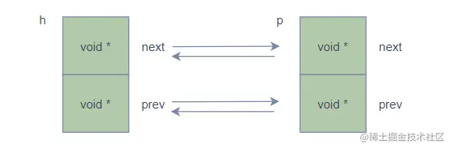
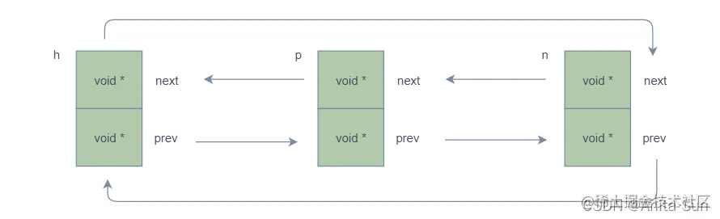
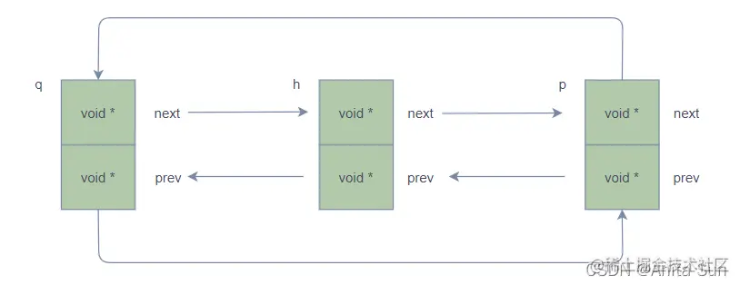

# libuv

这个libuv一直是我心中的痛，几番查看都无所获，希望此文档能帮我解开它的面纱

## 句柄 Handle

- 句柄表示能够在活动时执行特定操作的长期存在的对象
- libuv中所有的句柄都需要初始化，初始化的时候会调用ux_xxx_init, xxx表示句柄的类型
- libuv中句柄的种类

1. uv_loop_t 事件循环
2. uv_handle_t 基础句柄
3. uv_req_t 基础请求的句柄
4. uv_timer_t 计时器句柄
5. uv_prepare_t 准备句柄
6. uv_check_t 检查句柄
7. uv_idle_t 空转句柄
8. uv_async_t 异步句柄
9. uv_poll_t 轮询句柄
10. uv_signal_t 信号句柄
11. uv_process_t 进程句柄
12. uv_stream_t 流句柄
13. uv_tcp_t TCP句柄
14. uv_pipe_t 管道句柄
15. uv_tty_t TTY句柄
16. uv_udp_t UDP句柄
17. uv_fs_event_t fs event handle
18. uv_fs_poll_t fs poll handle


### uv_handle_t 基础的句柄

- 所有句柄的抽象基类

```c
struct uv_handle_s {
    UV_HANDLE_FIELDS
};

#define UV_HANDLE_FIELDS
    void* data; // 共有数据，指向用户自定义数据，libuv不使用
    // 只读数据
    uv_loop_t* loop; // 指向依赖的事件循环
    uv_handle_type type; // 句柄的类型
    // private
    uv_close_cb close_cb; // 句柄关闭时的回调函数
    void* handle_queue[2]; // 句柄队列指针,分别指向上一个和下一个，QUEUE结构
    union {
        int fd;
        void* reserved[4];
    } u;
    UV_HANDLE_PRIVATE FIELDS // 这里包含了下面的参数

#define UV_HANDLE_PRIVATE_FIELDS
    uv_handle_t* next_closeing; // 指向下一个需要关闭的handle
    usigned int flags; // 状态标记: 引用、关闭、正在关闭、激活等状态
```

- uv_handle_t 属性介绍

```
1、loop 为句柄所属的事件循环
2、type 为句柄类型，和uv_##name##_t强相关，对应的uv_##name##_t的type为UV_##NAME##。这种情况下可以通过handle->type很容易判断出来uv_handle_t子类的类型。
3、close_cb 句柄关闭时候执行的回调，入参参数为uv_handle_t的指针
4、handle_queue 句柄队列指针
5、u.fd 文件描述符
6、next_closing 下一个需要关闭的句柄，可以使得loop->closing_handles形成一个链表结构，从而方便删除


void uv__make_close_pending(uv_handle_t* handle) {
    assert(handle->flags & UV_HANDLE_CLOSING);
    assert(!(handle->flags & UV_HANDLE_CLOSED));
    handle->next_closing = handle->loop->closing_handles;  // loop->closing_handles作为下一个需要关闭的handle存放在loop对象中
    // 当前需要关闭的直接放在loop中
    handle->loop->closing_handles = handle;
  }

在初始化的时候，会把handle->next_closing以及loop->closing_handles全部置空。通过这段代码，可以看到，只要判断handle->next_closing是否为null 就可以知道是否全部关闭了

```

### uv_XXnameXX_t的实现

```c
struct uv_poll_s {
    UV_HANDLE_FIELDS // 基类
    uv_poll_cb poll_cb
    UV_POLL_PRIVATE_FIELDS  // 该类型独有的
}
```

在uv_poll_s数据结构中，第一个使用的宏就是UV_HANDLE_FIELDS宏，其次才为uv_poll_s的私有宏.所有的扩展的类型中均包含了uv_handle_t的结构体变量,所以任何的uv_XXnameXX_t都可以转换为uv_handle_t


### handle的基本操作

- uv_handle_init 初始化handle的类型，设置REF标记，插入handle队列

```c

1. 关联loop到handle,可以通过handle找到对应的Loop
2. 设置handle类型
3. 设置handle标识为UV_HANDLE_REF, 这个标识决定了handle是否引入引用计数，后续start Stop会看到用途
4. 将handle插入到loop->handle_queue队列的尾部,所有初始化的handle都会被插入到这个队列中去
5. 通过uv_handle_platform_init 平台特定初始化函数将 handle 的 next_closing 设置为 NULL，这是一个连接了所有关闭的 handle 的单链表
#define uv_handle_init(loop_,h,type_)
    do {
        (h)->loop = (loop_)
        (h)->type = (type_)
        (h)->flags = UV_HANDLE_REF // 设置REF标记
        // 所有handle都是由loop->handle_queue来管理的
        QUEUE_INSERT_TAIL(&(loop_)->handle_queue,&(h)->handle_queue);
         uv__handle_platform_init(h);   
    }
    while(0)

#if defined(_WIN32)
# define uv_handle_platform_init(h) ((h)->u.fd = -1)  
# else 
# define uv_handle_platform_init(h) ((h)->next_closing = NULL)
#endif   
```

如下是uv_timer_t的初始化函数uv_timer_init,它直接引用了uv_handle_init函数，其他派生类型一样

```c
int uv_timer_init(uv_loop_t* loop, uv_timer_t* handle) {
  uv__handle_init(loop, (uv_handle_t*)handle, UV_TIMER);
  handle->timer_cb = NULL;
  handle->repeat = 0;
  return 0;
}

```

> 这样初始化的操作就完成了

- uv_handle_start 设置标记handle为ACTIVE,如果设置了REF标记，则active handle的个数加1，active handle数会影响事件循环的退出

```c

// uv_handle_start将handle设置为UV_HANDLE_ACTIVE状态
// 并通过uv_active_handle_add更新活动的handle引用计数，如果不存在
// UV_HANDLE_REF标记位，则不会增加引用计数
// 虽然对 handle 进行了 Start 操作，但是实际仅仅是设置了个标志位和增加了一个引用计数而已，看不到任何的 Start，实际上是告诉 libuv 该 handle 准备好了，可以 Go 了。因为更新引用计数间接影响了事件循环的活动状态。

// uv_run 才是真正的启动操作，向 libuv 表明 Ready 了之后，uv_run 的时候才会处理这个 handle。
#define uv_handle_start(h)
    do {
        // 假设flags就是active的话，直接跳出
        if(((h)->flags & UV_HANDLE_ACTIVE) != 0) break;
        // 设置为active状态
        (h)->flags |= UV_HANDLE_ACTIVE;
        // 假设状态是REF，active + 1
        if(((h)->flags & UV_HANDLE_REF) != 0) uv_active_handle_add(h)
    }
    while(0)
#define uv_active_handle_add(h)
    do {
        (h)->loop->active_handles ++;
    }
    while(0)
```

- uv_handle_stop 和uv_handle_start相反

```c
// uv__handle_stop 将 handle 设置为 ~UV_HANDLE_ACTIVE 状态，并通过 uv__active_handle_rm 更新活动的 handle 引用计数。如果不存在 UV_HANDLE_REF 标志位，则不会减少引用计数。
#define uv__handle_stop(h)                                                   
 do {       
    // 假设状态不是active的状态，则直接跳出                                                                   
   if (((h)->flags & UV_HANDLE_ACTIVE) == 0) break;                          
   (h)->flags &= ~UV_HANDLE_ACTIVE;                                          
   if (((h)->flags & UV_HANDLE_REF) != 0) uv__active_handle_rm(h);           
 }                                                                           
 while (0)

```


- uv_handle_ref 标记handle为REF状态,如果handle是active状态，则active handle数加一

```c
#define uv_handle_ref(h)
do {
    // 如果已经是引用状态，则返回
    if(((h)->flags & UV_HANDLE_REF) != 0) break;
    // 设置成引用状态
    (h)->flags |= UV_HANDLE_REF;
    // 正在关闭，直接返回
    if(((h)->flags & UV_HANDLE_CLOSEING) != 0) break;
    // 激活状态下，将循环的active_handle + 1
    if(((h)->flags & UN_HANDLE_ACTIVE) != 0) uv__active_handle_add(h); 
}while(0)

```

- uv_handle_unref 去掉handle的REF状态,如果handle是active状态，则active handle数量减1

```c
#define uv_handle_unref(h)
do {
    if(((h)->flags & UV_HANDLE_REF) == 0) break;
    // 去掉ref标记
    (h)->flags &= ~UV_HANDLE_REF;
    if(((h)->flags & UV_HANDLE_CLOSEING) != 0) break;
    if(((h)->flags & UV_HANDLE_ACTIVE) != 0)  uv__active_handle_rm(h);
}while(0)
```

> libuv 中 handle 有 REF 和 ACTIVE 两个状态。当一个 handle 调用 xxx_init 函数的时候， 他首先被打上 REF 标记，并且插入 loop->handle 队列。当 handle 调用 xxx_start 函 数的时候，他首先被打上 ACTIVE 标记，并且记录 active handle 的个数加一。只有 ACTIVE 状态的 handle 才会影响事件循环的退出


## queue队列

### 定义指针数组类型

```c
typedef void *QUEUE[2];
// 使用
QUEUE q; // 相当于void *q[2]
```

QUEUE被声明为一个具备两个元素的数组，每个数组元素都是指针且指向了void

### 定义基本操作

```c
// 队列q的next指针
#define QUEUE_NEXT(q) (*(QUEUE **) & ((*(q))[0]))
// 队列的prev指针
#define QUEUE_PREV(q)       (*(QUEUE **) &((*(q))[1]))
// 
#define QUEUE_PREV_NEXT(q)  (QUEUE_NEXT(QUEUE_PREV(q)))
#define QUEUE_NEXT_PREV(q)  (QUEUE_PREV(QUEUE_NEXT(q)))
```

### QUEUE_NEXT

- 使用

```c
QUEUE queue;
// 返回值是下一个节点queue的指针
QUEUE_NEXT(&queue);
```

- (*(QUEUE **) &((\*(q))[0])) 相当于 (*q)[0],为什么要写的这么复杂呢？主要有两个原因：类型保持、成为左值。

- (*(q))[0]: 首先，传入q的类型为&QUEUE,那么(\*(q))类型为QUEUE, (\*(q))[0] 相当于queue[0]

- \*(QUEUE **) &((\*(q)))[0]: queue[0]的类型为void * ,那么&(queue[0])的类型就为void ** , 这可不行，明明应该是 QUEUE ** 类型，怎么能是 void **，所以要进行 (QUEUE **) &((\*(q))[0]) 类型转换。还是有问题，最后返回的是下一个节点QUEUE的指针，现在变成了指针的指针，所以还要对 (QUEUE **) &((\*(q))[0]) 再次取值 *(QUEUE **) &((\*(q))[0])

- 这时候你该问了：为什么不能写成 (QUEUE*)(*(q))[0] 这样的呢？这是为了使其成为左值，左值的简单定义是：占用实际的内存、可以对其进行取地址操作的变量都是左值，而c语言中（其实其他语言也是一样），对于一个变量（或者表达式）进行强制类型转换时，其实并不是改变该变量本身的类型，而是产生一个变量的副本，而这个副本并不是左值（因为并不能对其取地址），它是一个右值，举个例子：int a = 1; (char) a = 2;这样会报错。而如果改成这样：int a = 1; (\*(char *)(&a)) = 2;就正确了。


### 队列操作

- 队列初始化,初始化队列q就是将其next和prev的指针指向自己

```c
#define QUEUE_INIT(q)
do {
    QUEUE_NEXT(q) = (q)
    QUEUE_PREV(q) = (q)
}while(0)
```

- 队列为空判断, 只要是q的next指针还是指向自己，就说明队列为空，只有链表头节点

```c
#define QUEUE_EMPTY(q)
((const QUEUE *) (q) == (const QUEUE *) QUEUE_NEXT(Q))

```

- 队列遍历,遍历队列q,知道遍历到h位置。在遍历时候，不能同时对队列q进行插入、删除操作，否则会出现未知错误

```c
#define QUEUE_FOREACH(q,h)
for((q) = QUEUE_NEXT(h); (q) != (h);(q) = QUEUE_NEXT(q))
```

- 获取队列头, 链表头节点的next返回就是队列的head节点

```c
#define QUEUE_HEAD(q)
    (QUEUE_NEXT(q))
```

- 向队列头插入节点

```c
// prev是下一个元素,next是上一个元素
// 注意一下，这里都是给prev/next赋值q,h本身的
// h是头，q是要插入
#define QUEUE_INSERT_HEAD(h,q)
do {
    // q的next指向h的next,目前h的next指向自身
    // 所以q->next = h
    QUEUE_NEXT(q) = QUEUE_NEXT(h);
    // q->prev = h 
    QUEUE_PREV(q) = h;
    // q->next = h ,h->prev = q
    QUEUE_NEXT_PREV(q) = (q);
    // h->next = q
    QUEUE_NEXT(h) = (q); 
}while(0)
```




- 再插入一个节点 QUEUE_INSERT_HEAD(h,n)


```c

#define QUEUE_INSERT_HEAD(h,n)
do {
    // n->next = h->next = p
    QUEUE_NEXT(n) = QUEUE_NEXT(h);
    // n->prev = h 
    QUEUE_PREV(n) = h;
    // n->next = p p->prev = n
    QUEUE_NEXT_PREV(n) = (n);
    // h->next =  n
    QUEUE_NEXT(h) = (n); 
}while(0)

```



- 向队列尾部插入节点

```c

#define QUEUE_INSERT_TAIL(h,q)
do{
    QUEUE_NEXT(q) = (h)
    QUEUE_PREV(q) = QUEUE_PREV(h)
    QUEUE_PREV_NEXT(q) = (q)
    QUEUE_PREV(h) = (q)
}while(0)

```



- 队列相加

```c
#define QUEUE_ADD(h,n)
do {
    QUEUE_PREV_NEXT(h) = QUEUE_NEXT(n)
    QUEUE_NEXT_PREV(n) = QUEUE_PREV(h)
    QUEUE_PREV(h) = QUEUE_PREV(n)
    QUEUE_PREV_NEXT(h) = (h) 
}while(0)

```

- 队列分割

```c
#define QUEUE_SPLIT(h, q, n)
do {   
    QUEUE_PREV(n) = QUEUE_PREV(h)
    QUEUE_PREV_NEXT(n) = (n)
    QUEUE_NEXT(n) = (q)
    QUEUE_PREV(h) = QUEUE_PREV(q)
    QUEUE_PREV_NEXT(h) = (h)
    QUEUE_PREV(q) = (n)         
}while(0)
```


