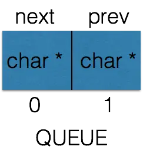

# libuv

这个libuv一直是我心中的痛，几番查看都无所获，希望此文档能帮我解开它的面纱

## 句柄 Handle

- 句柄表示能够在活动时执行特定操作的长期存在的对象
- libuv中所有的句柄都需要初始化，初始化的时候会调用ux_xxx_init, xxx表示句柄的类型
- libuv中句柄的种类

1. uv_loop_t 事件循环
2. uv_handle_t 基础句柄
3. uv_req_t 基础请求的句柄
4. uv_timer_t 计时器句柄
5. uv_prepare_t 准备句柄
6. uv_check_t 检查句柄
7. uv_idle_t 空转句柄
8. uv_async_t 异步句柄
9. uv_poll_t 轮询句柄
10. uv_signal_t 信号句柄
11. uv_process_t 进程句柄
12. uv_stream_t 流句柄
13. uv_tcp_t TCP句柄
14. uv_pipe_t 管道句柄
15. uv_tty_t TTY句柄
16. uv_udp_t UDP句柄
17. uv_fs_event_t fs event handle
18. uv_fs_poll_t fs poll handle


### uv_handle_t 基础的句柄

- 所有句柄的抽象基类

```c
struct uv_handle_s {
    UV_HANDLE_FIELDS
};

#define UV_HANDLE_FIELDS
    void* data; // 共有数据，指向用户自定义数据，libuv不使用
    // 只读数据
    uv_loop_t* loop; // 指向依赖的事件循环
    uv_handle_type type; // 句柄的类型
    // private
    uv_close_cb close_cb; // 句柄关闭时的回调函数
    void* handle_queue[2]; // 句柄队列指针,分别指向上一个和下一个，QUEUE结构
    union {
        int fd;
        void* reserved[4];
    } u;
    UV_HANDLE_PRIVATE FIELDS // 这里包含了下面的参数

#define UV_HANDLE_PRIVATE_FIELDS
    uv_handle_t* next_closeing; // 指向下一个需要关闭的handle
    usigned int flags; // 状态标记: 引用、关闭、正在关闭、激活等状态
```

- uv_handle_t 属性介绍

```
1、loop 为句柄所属的事件循环
2、type 为句柄类型，和uv_##name##_t强相关，对应的uv_##name##_t的type为UV_##NAME##。这种情况下可以通过handle->type很容易判断出来uv_handle_t子类的类型。
3、close_cb 句柄关闭时候执行的回调，入参参数为uv_handle_t的指针
4、handle_queue 句柄队列指针
5、u.fd 文件描述符
6、next_closing 下一个需要关闭的句柄，可以使得loop->closing_handles形成一个链表结构，从而方便删除


void uv__make_close_pending(uv_handle_t* handle) {
    assert(handle->flags & UV_HANDLE_CLOSING);
    assert(!(handle->flags & UV_HANDLE_CLOSED));
    handle->next_closing = handle->loop->closing_handles;  // loop->closing_handles作为下一个需要关闭的handle存放在loop对象中
    // 当前需要关闭的直接放在loop中
    handle->loop->closing_handles = handle;
  }

在初始化的时候，会把handle->next_closing以及loop->closing_handles全部置空。通过这段代码，可以看到，只要判断handle->next_closing是否为null 就可以知道是否全部关闭了

```

### uv_XXnameXX_t的实现

```c
struct uv_poll_s {
    UV_HANDLE_FIELDS // 基类
    uv_poll_cb poll_cb
    UV_POLL_PRIVATE_FIELDS  // 该类型独有的
}
```

在uv_poll_s数据结构中，第一个使用的宏就是UV_HANDLE_FIELDS宏，其次才为uv_poll_s的私有宏.所有的扩展的类型中均包含了uv_handle_t的结构体变量,所以任何的uv_XXnameXX_t都可以转换为uv_handle_t


### handle的基本操作

- uv_handle_init 初始化handle的类型，设置REF标记，插入handle队列

```c

1. 关联loop到handle,可以通过handle找到对应的Loop
2. 设置handle类型
3. 设置handle标识为UV_HANDLE_REF, 这个标识决定了handle是否引入引用计数，后续start Stop会看到用途
4. 将handle插入到loop->handle_queue队列的尾部,所有初始化的handle都会被插入到这个队列中去
5. 通过uv_handle_platform_init 平台特定初始化函数将 handle 的 next_closing 设置为 NULL，这是一个连接了所有关闭的 handle 的单链表
#define uv_handle_init(loop_,h,type_)
    do {
        (h)->loop = (loop_)
        (h)->type = (type_)
        (h)->flags = UV_HANDLE_REF // 设置REF标记
        // 所有handle都是由loop->handle_queue来管理的
        QUEUE_INSERT_TAIL(&(loop_)->handle_queue,&(h)->handle_queue);
         uv__handle_platform_init(h);   
    }
    while(0)

#if defined(_WIN32)
# define uv_handle_platform_init(h) ((h)->u.fd = -1)  
# else 
# define uv_handle_platform_init(h) ((h)->next_closing = NULL)
#endif   
```

如下是uv_timer_t的初始化函数uv_timer_init,它直接引用了uv_handle_init函数，其他派生类型一样

```c
int uv_timer_init(uv_loop_t* loop, uv_timer_t* handle) {
  uv__handle_init(loop, (uv_handle_t*)handle, UV_TIMER);
  handle->timer_cb = NULL;
  handle->repeat = 0;
  return 0;
}

```

> 这样初始化的操作就完成了

- uv_handle_start 设置标记handle为ACTIVE,如果设置了REF标记，则active handle的个数加1，active handle数会影响事件循环的退出

```c

// uv_handle_start将handle设置为UV_HANDLE_ACTIVE状态
// 并通过uv_active_handle_add更新活动的handle引用计数，如果不存在
// UV_HANDLE_REF标记位，则不会增加引用计数
// 虽然对 handle 进行了 Start 操作，但是实际仅仅是设置了个标志位和增加了一个引用计数而已，看不到任何的 Start，实际上是告诉 libuv 该 handle 准备好了，可以 Go 了。因为更新引用计数间接影响了事件循环的活动状态。

// uv_run 才是真正的启动操作，向 libuv 表明 Ready 了之后，uv_run 的时候才会处理这个 handle。
#define uv_handle_start(h)
    do {
        // 假设flags就是active的话，直接跳出
        if(((h)->flags & UV_HANDLE_ACTIVE) != 0) break;
        // 设置为active状态
        (h)->flags |= UV_HANDLE_ACTIVE;
        // 假设状态是REF，active + 1
        if(((h)->flags & UV_HANDLE_REF) != 0) uv_active_handle_add(h)
    }
    while(0)
#define uv_active_handle_add(h)
    do {
        (h)->loop->active_handles ++;
    }
    while(0)
```

- uv_handle_stop 和uv_handle_start相反

```c
// uv__handle_stop 将 handle 设置为 ~UV_HANDLE_ACTIVE 状态，并通过 uv__active_handle_rm 更新活动的 handle 引用计数。如果不存在 UV_HANDLE_REF 标志位，则不会减少引用计数。
#define uv__handle_stop(h)                                                   
 do {       
    // 假设状态不是active的状态，则直接跳出                                                                   
   if (((h)->flags & UV_HANDLE_ACTIVE) == 0) break;                          
   (h)->flags &= ~UV_HANDLE_ACTIVE;                                          
   if (((h)->flags & UV_HANDLE_REF) != 0) uv__active_handle_rm(h);           
 }                                                                           
 while (0)

```


- uv_handle_ref 标记handle为REF状态,如果handle是active状态，则active handle数加一

```c
#define uv_handle_ref(h)
do {
    // 如果已经是引用状态，则返回
    if(((h)->flags & UV_HANDLE_REF) != 0) break;
    // 设置成引用状态
    (h)->flags |= UV_HANDLE_REF;
    // 正在关闭，直接返回
    if(((h)->flags & UV_HANDLE_CLOSEING) != 0) break;
    // 激活状态下，将循环的active_handle + 1
    if(((h)->flags & UN_HANDLE_ACTIVE) != 0) uv__active_handle_add(h); 
}while(0)

```

- uv_handle_unref 去掉handle的REF状态,如果handle是active状态，则active handle数量减1

```c
#define uv_handle_unref(h)
do {
    if(((h)->flags & UV_HANDLE_REF) == 0) break;
    // 去掉ref标记
    (h)->flags &= ~UV_HANDLE_REF;
    if(((h)->flags & UV_HANDLE_CLOSEING) != 0) break;
    if(((h)->flags & UV_HANDLE_ACTIVE) != 0)  uv__active_handle_rm(h);
}while(0)
```

> libuv 中 handle 有 REF 和 ACTIVE 两个状态。当一个 handle 调用 xxx_init 函数的时候， 他首先被打上 REF 标记，并且插入 loop->handle 队列。当 handle 调用 xxx_start 函 数的时候，他首先被打上 ACTIVE 标记，并且记录 active handle 的个数加一。只有 ACTIVE 状态的 handle 才会影响事件循环的退出


- uv_close 对于handle来说，还有一个close方法,你可以认为是init的反向操作,它将handle从loop->handle_queue移除

```c
void uv_close(uv_handle_t* handle, uv_close_cb close_cb) {
  assert(!uv__is_closing(handle));

  handle->flags |= UV_HANDLE_CLOSING;
  handle->close_cb = close_cb;

  switch (handle->type) {
    // ...
  }

  uv__make_close_pending(handle);
}

void uv__make_close_pending(uv_handle_t* handle) {
  assert(handle->flags & UV_HANDLE_CLOSING);
  assert(!(handle->flags & UV_HANDLE_CLOSED));
  handle->next_closing = handle->loop->closing_handles;
  handle->loop->closing_handles = handle;
}

在loop上有一个closing_handles字段，这是一个单向的链表，关联了处于关闭进行中的handle,这个字段的类型是uv_handle_t*,指向了uv_handle_t,而uv_handle_s 存在了一个uv_handle_t*类型的指针next_closing指向下一个handle

uv_close通过调用uv_make_close_pending将待关闭的handle放到loop->closing_handles链表的末尾

在uv_run的call close callbacks阶段，通过函数uv_run_closing_handles来处理loop->closing_handles

int uv_run(uv_loop_t* loop, uv_run_mode mode) {
  while (r != 0 && loop->stop_flag == 0) {
    uv__run_closing_handles(loop);
  }
}

static void uv__run_closing_handles(uv_loop_t* loop) {
  uv_handle_t* p;
  uv_handle_t* q;

  p = loop->closing_handles;
  loop->closing_handles = NULL;

  while (p) {
    q = p->next_closing;
    uv__finish_close(p);
    p = q;
  }
}

static void uv__finish_close(uv_handle_t* handle) {
  assert(handle->flags & UV_HANDLE_CLOSING);
  assert(!(handle->flags & UV_HANDLE_CLOSED));
  handle->flags |= UV_HANDLE_CLOSED;

  switch (handle->type) {
    // 
  }

  uv__handle_unref(handle);
  QUEUE_REMOVE(&handle->handle_queue);

  if (handle->close_cb) {
    handle->close_cb(handle);
  }
}

首先将closing_handles从loop中摘除，然后遍历closing_handles,通过uv_finish_close对于每个handle进行最后的close,handle被移除loop->handle_queue并调用其关联的close_cb,至此handle彻底没有了和loop的关联走完了完成的生命周期。


```

> handle就这样伴随着事件循环经历了 init -> start -> stop -> close 等生命周期

## queue队列

### 定义指针数组类型

```c
typedef void *QUEUE[2];
// 使用
QUEUE q; // 相当于void *q[2]
```

QUEUE被声明为一个具备两个元素的数组，每个数组元素都是指针且指向了void

### 定义基本操作

```c
// 队列q的next指针
#define QUEUE_NEXT(q) (*(QUEUE **) & ((*(q))[0]))
// 队列的prev指针
#define QUEUE_PREV(q)       (*(QUEUE **) &((*(q))[1]))
// 
#define QUEUE_PREV_NEXT(q)  (QUEUE_NEXT(QUEUE_PREV(q)))
#define QUEUE_NEXT_PREV(q)  (QUEUE_PREV(QUEUE_NEXT(q)))
```

### QUEUE_NEXT

- 使用

```c
QUEUE queue;
// 返回值是下一个节点queue的指针
QUEUE_NEXT(&queue);
```

- (*(QUEUE **) &((\*(q))[0])) 相当于 (*q)[0],为什么要写的这么复杂呢？主要有两个原因：类型保持、成为左值。

- (*(q))[0]: 首先，传入q的类型为&QUEUE,那么(\*(q))类型为QUEUE, (\*(q))[0] 相当于queue[0]

- \*(QUEUE **) &((\*(q)))[0]: queue[0]的类型为void * ,那么&(queue[0])的类型就为void ** , 这可不行，明明应该是 QUEUE ** 类型，怎么能是 void **，所以要进行 (QUEUE **) &((\*(q))[0]) 类型转换。还是有问题，最后返回的是下一个节点QUEUE的指针，现在变成了指针的指针，所以还要对 (QUEUE **) &((\*(q))[0]) 再次取值 *(QUEUE **) &((\*(q))[0])

- 这时候你该问了：为什么不能写成 (QUEUE*)(*(q))[0] 这样的呢？这是为了使其成为左值，左值的简单定义是：占用实际的内存、可以对其进行取地址操作的变量都是左值，而c语言中（其实其他语言也是一样），对于一个变量（或者表达式）进行强制类型转换时，其实并不是改变该变量本身的类型，而是产生一个变量的副本，而这个副本并不是左值（因为并不能对其取地址），它是一个右值，举个例子：int a = 1; (char) a = 2;这样会报错。而如果改成这样：int a = 1; (\*(char *)(&a)) = 2;就正确了。




### 队列操作

- 队列初始化,初始化队列q就是将其next和prev的指针指向自己

```c
#define QUEUE_INIT(q)
do {
    QUEUE_NEXT(q) = (q)
    QUEUE_PREV(q) = (q)
}while(0)
```

- 队列为空判断, 只要是q的next指针还是指向自己，就说明队列为空，只有链表头节点

```c
#define QUEUE_EMPTY(q)
((const QUEUE *) (q) == (const QUEUE *) QUEUE_NEXT(Q))

```

- 队列遍历,遍历队列q,知道遍历到h位置。在遍历时候，不能同时对队列q进行插入、删除操作，否则会出现未知错误

```c
#define QUEUE_FOREACH(q,h)
for((q) = QUEUE_NEXT(h); (q) != (h);(q) = QUEUE_NEXT(q))
```

- 获取队列头, 链表头节点的next返回就是队列的head节点

```c
#define QUEUE_HEAD(q)
    (QUEUE_NEXT(q))
```

- 向队列头插入节点

```c
// prev是下一个元素,next是上一个元素
// 注意一下，这里都是给prev/next赋值q,h本身的
// h是头，q是要插入
#define QUEUE_INSERT_HEAD(h,q)
do {
    // q的next指向h的next,目前h的next指向自身
    // 所以q->next = h
    QUEUE_NEXT(q) = QUEUE_NEXT(h);
    // q->prev = h 
    QUEUE_PREV(q) = h;
    // q->next = h ,h->prev = q
    QUEUE_NEXT_PREV(q) = (q);
    // h->next = q
    QUEUE_NEXT(h) = (q); 
}while(0)
```


- 再插入一个节点 QUEUE_INSERT_HEAD(h,n)


```c

#define QUEUE_INSERT_HEAD(h,n)
do {
    // n->next = h->next = p
    QUEUE_NEXT(n) = QUEUE_NEXT(h);
    // n->prev = h 
    QUEUE_PREV(n) = h;
    // n->next = p p->prev = n
    QUEUE_NEXT_PREV(n) = (n);
    // h->next =  n
    QUEUE_NEXT(h) = (n); 
}while(0)

```


- 向队列尾部插入节点

```c

#define QUEUE_INSERT_TAIL(h,q)
do{
    QUEUE_NEXT(q) = (h)
    QUEUE_PREV(q) = QUEUE_PREV(h)
    QUEUE_PREV_NEXT(q) = (q)
    QUEUE_PREV(h) = (q)
}while(0)

```


- 队列相加

```c
#define QUEUE_ADD(h,n)
do {
    QUEUE_PREV_NEXT(h) = QUEUE_NEXT(n)
    QUEUE_NEXT_PREV(n) = QUEUE_PREV(h)
    QUEUE_PREV(h) = QUEUE_PREV(n)
    QUEUE_PREV_NEXT(h) = (h) 
}while(0)

```

- 队列分割

```c
#define QUEUE_SPLIT(h, q, n)
do {   
    QUEUE_PREV(n) = QUEUE_PREV(h)
    QUEUE_PREV_NEXT(n) = (n)
    QUEUE_NEXT(n) = (q)
    QUEUE_PREV(h) = QUEUE_PREV(q)
    QUEUE_PREV_NEXT(h) = (h)
    QUEUE_PREV(q) = (n)         
}while(0)
```

- 队列删除,先将q前一个节点的next指针修改为指向q的next指针指向的下一个节点，再q的下一个节点的prev指针修改为q当前指向的前一个节点

```c

#define QUEUE_REMOVE(q)
do {
    QUEUE_PREV_NEXT(q) = QUEUE_NEXT(q)
    QUEUE_NEXT_PREV(q) = QUEUE_PREV(q)
}while(0)

```

## 事件循环

事件循环是libuv的核心

```c
#include <stdio.h>
#include <stdlib.h>
#include <uv.h>

int main(){
    uv_loop_t* loop = uv_default_loop();
    uv_run(loop,UV_RUN_DEFAULT);
    uv_loop_close(loop);
    printf("quit.\n");
    return 0;
}
```


### uv_loop_init ---- uv_default_loop

```c
static uv_loop_t default_loop_struct;
static uv_loop_t* default_loop_ptr;

uv_loop_t* uv_default_loop(void){
    if(default_loop_ptr != NULL){
        return default_loop_ptr;
    }
    if(uv_loop_init(&default_loop_struct))
        return NULL
    default_loop_ptr = &default_loop_struct;
    return default_loop_ptr;    
}

int uv_loop_init(uv_loop_t* loop){
    void* saved_data;
    int err;

    // 数据清零
    saved_data = loop->data;
    memset(loop,0 ,sizeof(*loop));
    loop->data = saved_data;

    // 定时器uv_timer_t 相关
    heap_init((struct heap*) & loop->timer_heap);
    // 初始化用于接收线程池中已完成任务的队列
    QUEUE_INIT(&loop->wq);
    // 初始化uv_idle_t队列
    QUEUE_INIT(&loop->idle_handles);
    // 初始化uv_async_t队列
    QUEUE_INIT(&loop->async_handles);
    // 初始化uv_check_t队列
    QUEUE_INIT(&loop->check_handles);
    // 初始化uv_prepare_t队列
    QUEUE_INIT(&loop->prepare_handles);
    // 初始化uv_handle_t队列,所有初始化的handle都会放到此队列中
    QUEUE_INIT(&loop->handle_queue);

    // 初始化活跃的handle和request数量
    loop->active_handles = 0;
    loop->active_reqs.count = 0;

    // 开始初始化IO观察者相关的字段
    loop->nfds = 0;
    // IO观察者数组首地址指针
    loop->watchers = NULL;
    // IO观察者数组数量
    loop->nwatchers = 0;
    // 初始化挂起的IO观察者队列，挂起的IO观察者会被插入此队列延迟处理
    QUEUE_INIT(&loop->pending_queue);
    // 初始化IO观察者队列，所有初始化后的IO观察者都会被插入此队列
    QUEUE_INIT(&loop->watcher_queue);

    // 关闭的handle队列，单向链表
    loop->closing_handles = NULL;
    // 初始化计时器 loop->time
    uv_update_time(loop);
    // us_async_t
    // 初始化async_io_watcher,他是一个IO观察者
    loop->async_io_watcher.fd = -1;
    loop->async_wfd = -1;
    // uv_signal_t
    loop->signal_pipefd[0] = -1;
    loop->signal_pipefd[1] = -1;
    // epoll_create
    loop->backend_fd = -1;
    // emfile 错误相关
    loop->emfile_fd = -1;
    // 定时器计数器
    loop->timer_counter = 0;
    // 事件循环关闭标识
    loop->stop_flag = 0;
    // 平台特定初始化
    err = uv_platform_loop_init(loop);
    if(err)
        return err;
    // uv_signal_t
    // 初始化进程信号
    uv_signal_global_once_init();
    // uv_process_t
    // 初始化子进程信号观察者
    err = uv_signal_init(loop,&loop->child_watcher);
    if(err)
        goto fail_signal_init;
    //解引用loop->child_watcher
    uv_handle_unref(&loop->child_watcher)
    loop->child_watcher.flags |= UV_HANDLE_INTERNAL
    // 初始化子进程handle队列
    QUEUE_INIT(&loop->process_handles)
    // 初始化线程读写锁
    err = uv_rwlock_init(&loop->cloexec_lock);
    if(err)
        goto fail_rwlock_init;
    // 初始化线程互斥量锁
     err = uv_mutex_init(&loop->wq_mutex);
    if (err)   
        goto fail_mutex_init;   
    // uv_work_t
    // 初始化loop->wq_async,用于结束任务完成信号，并注册处理函数
    err = uv_async_init(loop, &loop->wq_async, uv__work_done);
    if (err)
        goto fail_async_init;
    // 解引用
    uv__handle_unref(&loop->wq_async);
    loop->wq_async.flags |= UV_HANDLE_INTERNAL;
    return 0;    
    fail_async_init:
        uv_mutex_destroy(&loop->wq_mutex);

    fail_mutex_init:
        uv_rwlock_destroy(&loop->cloexec_lock);

    fail_rwlock_init:
        uv__signal_loop_cleanup(loop);

    fail_signal_init:
        uv__platform_loop_delete(loop);

    return err;      
}

```


### uv_run 

- UV_RUN_DEAUFLT: 运行事件循环直到没有更多的活动的和被引用的句柄或请求
- UV_RUN_ONCE : 轮询一次
- UV_RUN_NOWAIT: 轮询一次但不会阻塞


```c

int uv_run(uv_loop_t* loop,uv_run_mode mode){
    int timeout;
    int r;
    int ran_pending;
    r = uv_loop_alive(loop);
    if(!r)
        uv_update_time(loop);
     while(r != 0 && loop->stop_flag == 0){
        // 更新时间并开始倒计时loop->time
        uv_update_time(loop);
        // 在这里找到超时的节点，运行回调
        uv_run_times(loop);
        // 处理挂起的handle，ran_peding代表pending队列是否为空
        ran_pending = uv_run_pending(loop);
        // 运行idle handle
        ur_run_idle(loop);
        // 运行prepare handle
        uv_run_prepare(loop);
        timeout = 0;
        // 默认模式计算阻塞时间,包含once模式下并且有pending节点的时候
        if ((mode == UV_RUN_ONCE && !ran_pending) || mode == UV_RUN_DEFAULT)
            timeout = uv_backend_timeout(loop);
        // 计算要阻塞的时间，开始阻塞    
        uv_io_poll(loop,timeout);
        // 程序执行到这里，意味着被唤醒了
        // 被唤醒的原因可能是IO读写、超时，检查handle是否可以操作
        uv_run_check(loop);
        // 检查是否有close的handle
        uv_run_closing_handles(loop);
        // 单次模式
        if(mode == UV_RUN_ONCE){
            // 还有一次执行超时回调的机会
            uv__update_time(loop);
            uv__run_timers(loop);
        }
        // handle保活处理
        r = uv_loop_alice(loop);
        if(mode == UV_RUN_ONCE || mode == UN_RUN_NOW) break;  
     }
     if(loop->stop_flag != 0){
        loop->stop_flag = 0;
     }   
     return r;
}

可以看到uv_run内部就是一个while循环，在uv_run_once和uv_run_nowait两种模式下，循环在执行一次后就会break,一次性的，实际上没有循环.另外在uv_loop_alive(loop) == 0 或者 loop->stop_flag != 0 的时候无法进入循环，同样循环结束，uv_run函数返回


uv_loop_alive 判断事件循环是否可以继续执行下去

static int uv_loop_alive(const uv_loop_t* loop){
    return uv_has_active_handles(loop) || uv_has_active_reqs(loop) || !QUEUE_EMPTY(&loop->pending_queue) ||
         loop->closing_handles != NULL;
}

uv_update_time  更新当前的时间

UV_UNUSED(static void uv__update_time(uv_loop_t* loop)) {
  /* Use a fast time source if available.  We only need millisecond precision.
   */
  loop->time = uv__hrtime(UV_CLOCK_FAST) / 1000000;
}


uv_run_pending 执行loop->pending_queue队列中的回调函数

static int uv__run_pending(uv_loop_t* loop) {
  QUEUE* q;
  QUEUE pq;
  uv__io_t* w;

  if (QUEUE_EMPTY(&loop->pending_queue))
    return 0;

  QUEUE_MOVE(&loop->pending_queue, &pq);

  while (!QUEUE_EMPTY(&pq)) {
    q = QUEUE_HEAD(&pq);
    QUEUE_REMOVE(q);
    QUEUE_INIT(q);
    w = QUEUE_DATA(q, uv__io_t, pending_queue);
    w->cb(loop, w, POLLOUT);
  }

  return 1;
}


```


### stop

stop将使事件循环在下一次循环因不满足条件而无法进入

```c
void uv_stop(uv_loop_t* loop){
    loop->stop_flag = 1;
}

调用uv_stop后，事件循环同样无法进入，程序退出

```


##  定时器

在libuv中，定时器是以最小堆来实现的,即最快过期的节点是根节点

### 数据结构

```c
struct uv_timer_s {
    // uv_handle_t
    void* data;
    uv_loop_t* loop;
    uv_handle_type type;
    uv_close_cb close_cb;
    void* handle_queue[2];
    union {
        int fd;
        void* reserved[4];
    } u;
    uv_handle_t* next_closing;
    unsigned int flags;

    // 定时器相关参数
    uv_timer_cb timer_cb;
    void* heap_node[3];
    unint64_t timeout;
    unint64_t repeat;
    unint64_t start_id;
}

```

### uv_timer_init

```c

int uv_timer_init(uv_loop_t* loop, uv_timer_t* handle){
    uv_handle_init(loop,(uv_handle_t*)handle,UV_TIMER);
    handle->timer_cb = NULL;
    handle->timeout = 0;
    handle->repeat = 0;
    return 0
}

```

### uv_timer_start

```c
int uv_timer_start(uv_timer_t* handle,uv_timer_cb cb,unit64_t timeout,unit64_t repeat){
    unit64_t clamped_timeout;
    // 如果这个计时器句柄是关闭的或者回调函数是null
    if(uv_is_closing(handle) || cb == NULL) return UV_EINVAL;
    // 重新执行start的时候将之前的停掉
    if(uv_is_active(handle)) uv_timer_stop(handle);
    // 超时时间
    // handle->loop->time 是在uv_run中每一次while循环开始的时间
    clamped_timeout = handle->loop->time + timeout;
    if (clamped_timeout < timeout)
        clamped_timeout = (uint64_t) -1;
    // 初始化回调，超时时间，是否重复计时，赋予一个独立的id
    handle->timer_cb = cb;
    handle->timeout = clamped_timeout;
    handle->repeat = repeat;
    handle->start_id = handle->loop->timer_counter ++;

    // 插入最小堆
    heap_insert(timer_heap(handle->loop),(struct heap_node*) &handle->heap_node,timer_less_than);
    // 激活
    uv_handle_start(handle);
    return 0;
}

```

### uv_run_timers 

找出已经超时的节点，并执行回调

```c
void uv_run_timers(uv_loop_t* loop){
    struct heap_node* heap_node;
    uv_timer_t* handle;

    for(;;){
        heap_node = heap_min(timer_heap(loop))
        if(heap_node == NULL)
            break;
        handle = container_of(heap_node,uv_timer_t, heap_node);
        // 每次取出的节点都是最小堆中最小的节点
        // 如果当前节点的时间大于当前时间则返回，说明后面的节点也没有超时
        if(handle->timeout > loop->time)
            break;
        // 移除该计时器节点，重新插入最小堆，如果设置了repeat的话
        uv_timer_stop(handle)
        uv_timer_again(handle)
        handle->timer_cb(handle)        
    }
}

```

libuv在每次事件循环开始的时候都会缓存当前的时间，在整个一轮的事件循环中，使用的都是这个缓存的时间。缓存了当前的最新时间后，就执行uv_run_timers,该函数的逻辑很明了了，就是遍历最小堆，找出当前超时的节点。执行完回调之后，stop --> again


### uv_timer_stop 


```c
int uv_timer_stop(uv_timer_t* handle){
    if(!uv_is_active(handle)){
        return 0;
    }
    // 从最小堆中将该计时器移除
    heap_remove(timer_heap(handle->loop),(struct heap_node*) &handle->heap_node,timer_less_than);
    // 清除激活状态和handle的active数减一
    uv_handle_stop(handle)
    return 0
}


```

### uv_timer_again


```c
int uv_timer_again(uv_timer_t* handle) {
  if (handle->timer_cb == NULL)
    return UV_EINVAL;

  // 如果设置了repeat标记说明计时器是需要重复触发的
  if (handle->repeat) {
    // 先把旧的计时器节点从最小堆中移除，然后再重新开启一个计时器
    uv_timer_stop(handle);
    uv_timer_start(handle, handle->timer_cb, handle->repeat, handle->repeat);
  }
  return 0;
}
```


## idle/prepare/check状态

### idle

空转句柄将在每次循环迭代时运行给定的回调函数一次,在uv_prepare_t句柄前一刻

- 数据类型

```c

 // 句柄[handle]相关参数
   // uv_handle_t
   void* data;
   uv_loop_t* loop;
   uv_handle_type type;
   uv_close_cb close_cb;
   void* handle_queue[2];
   union {                                                                 
     int fd;                                                                   
     void* reserved[4];                                                        
   } u; 
   uv_handle_t* next_closing;
   unsigned int flags;

   // idle 相关参数
   uv_idle_cb idle_cb;                                                     
   void* queue[2]; 

```

- 实例

```c

#include <stdio.h>
#include <stdlib.h>
#include <uv.h>

int64_t num = 0;

void my_idle_cb(uv_idle_t* handle)
{
    num++;
    if (num >= 10e6) {
        printf("idle stop, num = %ld\n", num);
        uv_idle_stop(handle);
    }
}

int main() 
{
    uv_idle_t idler;
    
    // 初始化句柄
    uv_idle_init(uv_default_loop(), &idler);

    printf("idle start, num = %ld\n", num);
    // 以 my_idle_cb 开始句柄
    uv_idle_start(&idler, my_idle_cb);

    uv_run(uv_default_loop(), UV_RUN_DEFAULT);

    return 0;
}

```

- 在每次的时间循环中调用my_idle_cb函数,知道num的值达到


### prepare

- 准备句柄实在每次循环迭代时运行给定的回调函数一次，在IO轮询前一刻

- 数据类型

```c

struct uv_prepare_t {
   // 句柄[handle]相关参数
   // uv_handle_t
   void* data;
   uv_loop_t* loop;
   uv_handle_type type;
   uv_close_cb close_cb;
   void* handle_queue[2];
   union {                                                                     
     int fd;                                                                   
     void* reserved[4];                                                        
   } u; 
   uv_handle_t* next_closing;
   unsigned int flags;

   // idle 相关参数
   uv_prepare_cb prepare_cb;                                                    
   void* queue[2];                                                         
}
```

- 实例

```c
#include <stdio.h>
#include <stdlib.h>
#include <uv.h>

int64_t num = 0;

void my_idle_cb(uv_idle_t* handle)
{
    num++;
    printf("idle callback\n");
    if (num >= 5) {
        printf("idle stop, num = %ld\n", num);
        uv_stop(uv_default_loop());
    }
}

void my_prep_cb(uv_prepare_t *handle) 
{
    printf("prep callback\n\n");
}

int main() 
{
    uv_idle_t idler;
    uv_prepare_t prep;

    uv_idle_init(uv_default_loop(), &idler);
    uv_idle_start(&idler, my_idle_cb);
    
    // 初始化句柄
    uv_prepare_init(uv_default_loop(), &prep);
    // 以 my_prep_cb 开始句柄
        

    uv_run(uv_default_loop(), UV_RUN_DEFAULT);

    return 0;
}
```

- idle和prepare的区别

貌似没区别，对后面的阻塞时间的影响是有的


```c
int uv_backend_timeout(const uv_loop_t* loop) {
    // 下面几种情况下返回0，即不阻塞在epoll_wait 
    if (loop->stop_flag != 0)
      return 0;

    // 没有东西需要处理，则不需要阻塞poll io阶段
    if (!uv__has_active_handles(loop) && !uv__has_active_reqs(loop))
      return 0;

    // idle阶段有任务，不阻塞，尽快返回直接idle任务
    if (!QUEUE_EMPTY(&loop->idle_handles))
      return 0;

    if (loop->closing_handles)
      return 0;

    // 返回下一个最早过期的时间，即最早超时的节点
    return uv__next_timeout(loop);
}

```


### check

- 检查句柄将在每次循环迭代时候运行给定的回调函数，在IO之后

- 这里没啥特殊的，就不再总结了


## IO

### io观察者

- 数据结构

```c
struct uv_io_s {
    uv_io_cb cb; // 事件触发的回调
    // 用户插入队列
    void* pending_queue[2];
    void* watcher_queue[2];
    // 保存本次感兴趣的事件，在插入io观察者队列的时候设置
    unsigned int pevents;
    // 保存当前感兴趣的事件
    unsigned int events;
    int fd;
}

```
- io观察者就是封装了事件和回调的结构体，然后插入到loop维护的观察者队列，在poll io阶段，libuv会根据io观察者描述的信息，往底层的事件驱动模块注册相应的信息。当注册的事件触发的时候，io观察者的回调就会被执行。


### 基本操作

```c


```

